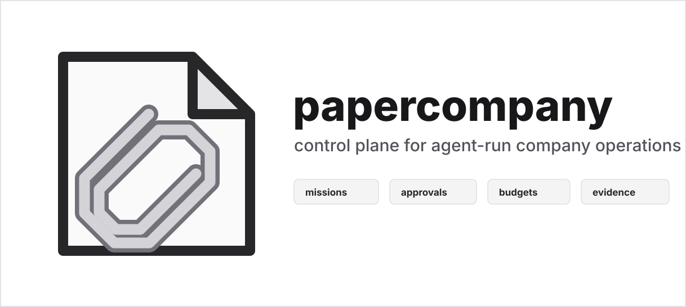

<p align="center">
  
</p>

<p align="center">
  <a href="#%ED%80%B5%EC%8A%A4%ED%83%80%ED%8A%B8"><strong>퀵스타트</strong></a> &middot;
  <a href="doc/DEVELOPING.md"><strong>문서</strong></a> &middot;
  <a href="https://github.com/insightflo/papercompany-runtime"><strong>GitHub</strong></a> &middot;
  <a href="https://discord.gg/m4HZY7xNG3"><strong>Discord</strong></a>
</p>

<p align="center">
  <a href="LICENSE"></a>
  <a href="https://github.com/insightflo/papercompany-runtime"></a>
  <a href="https://discord.gg/m4HZY7xNG3"></a>
</p>

<br/>

> `papercompany`는 오픈소스 [Paperclip base](https://github.com/paperclipai/paperclip) 위에 구축된, 에이전트 기업을 위한 미션 중심 운영 체제입니다. 원래 Paperclip 프로젝트는 `paperclipai`, `PAPERCLIP_*`, `~/.paperclip` 등 여러 패키지 이름·CLI 명령·환경 변수·호환 경로의 업스트림 원천으로 남아 있습니다.

## papercompany란?

# 에이전트 팀을 위한 오픈소스 운영 체제

**OpenClaw가 _직원_이라면, papercompany는 _회사_입니다**

papercompany는 Node.js 서버와 React UI로 구성된, 에이전트 팀을 실제 기업 안에서 조율하는 시스템입니다. 에이전트를 직접 가져와서 미션과 목표를 정의하고, 하나의 대시보드에서 작업·승인·비용·성과를 추적할 수 있습니다.

papercompany는 회사가 이미 업무에 사용 중인 시스템을 대체하려 하지 않습니다. 에이전트 팀이 공유 규칙·가시성·거버넌스를 갖춘 상태로 그 시스템들을 통해 운영되도록 돕는 컨트롤 플레인 역할을 합니다.

papercompany는 일상적인 CLI 직접 사용의 한 단계 위에 있습니다. 커뮤니티 모범 사례가 기준층이라면, 일상 CLI 작업은 현실층이고, papercompany는 그 현실을 거버넌스가 적용된 팀 운영으로 바꾸는 조직적 하네스입니다. 단순한 오케스트레이션 도구가 아니라, 임시방편적 에이전트 작업에서 지속 가능한 기업 운영으로 가는 다리입니다.

**풀 리퀘스트가 아니라 기업 운영을 관리하세요.**

|        | 단계            | 예시                                                              |
| ------ | --------------- | ----------------------------------------------------------------- |
| **01** | 미션 정의        | _"업계 1위 AI 메모 앱을 만들어 월 100만 달러 MRR 달성."_              |
| **02** | 팀 고용          | CEO, CTO, 엔지니어, 디자이너, 마케터 — 어떤 봇이든, 어떤 제공자든.  |
| **03** | 승인 후 실행      | 전략 검토. 예산 설정. 시작. 대시보드에서 모니터링.                  |

<br/>

## Paperclip base에서 무엇이 바뀌었나

papercompany는 업스트림 Paperclip 컨트롤 플레인 기반을 유지하면서, 단순히 에이전트 작업을 조율하는 것에서 에이전트 기업을 운영하는 것으로 제품을 바꿉니다. 차이를 정의하는 8가지 진화:

| # | 진화 | 추가된 것 |
| --- | --- | --- |
| 1 | **에이전트 워크플로 하네스** | DAG 스텝 런, 툴 스텝, 에이전트 스텝, 미션을 끝까지 오케스트레이션하는 네이티브 워크플로 엔진을 갖춘 실행 가능한 워크플로 정의. |
| 2 | **미션 중심 실행** | 작업이 미션(증거 게이트가 적용된 실행 슬라이스, 위임, 거버넌스 스레드, 런타임 스냅샷)을 중심으로 구성됩니다. |
| 3 | **QA 평가 & 루프** | 미션 완료 품질을 보장하는 품질 리뷰 항목, 평가자 버전, 증거 제출, 평결, 일일 보고서. |
| 4 | **에이전트 위키** | 에이전트가 같은 실수를 반복하지 않도록 참고하는 회사 지식 베이스. |
| 5 | **가드 레일** | 의도치 않은 에이전트 동작을 차단하는 워크트리 규칙, 툴 그랜트, 권한 그룹, 실행 정책. |
| 6 | **QA 평가 & 진화 시스템** | QA 시스템이 시간이 지나며 개선되도록 하는 앵커 예시, 후보 런 재생, 평가자 버전 승격. |
| 7 | **툴 등록 & 에이전트 권한** | 회사가 툴(실행 프로그램 또는 외부 실행 경로)을 등록하고 어떤 에이전트가 호출할 수 있는지 제어. |
| 8 | **워크 프로덕트** | S3 호환 또는 로컬 객체 스토리지로 백업된 워크 프로덕트 스토리지를 통한 산출물의 공식 저장. |

| 영역 | papercompany에서 바뀐 것 |
| --- | --- |
| **제품 모델** | 핵심 단위는 에이전트 운영 회사입니다. 미션, 목표, 조직 구조, 예산, 승인, 워크 프로덕트, 성과가 하나의 운영 루프로 취급됩니다. |
| **미션 실행** | 미션은 이제 단순 작업 컨테이너가 아니라 워크플로 런, 거버넌스 결정, 이슈 계획, 복구 상태, 증거 요구사항을 담습니다. |
| **증거와 산출물** | 완료는 가시적인 워크 프로덕트, 아티팩트, 보고서, 파일, 링크, 검증 신호와 연결됩니다. 에이전트의 자체 보고만으로는 완료로 취급하지 않습니다. |
| **워크플로 소유권** | 서버 네이티브 워크플로/DAG 실행이 워크플로 정의, 런, 스텝 런, 재개 동작, 하위 스텝 구체화를 소유합니다. |
| **회사 간 작업** | 미션 위임이 거버넌스가 적용된 대상 회사 미션을 만들 수 있고, 원천 회사는 차단된 핸드오프 이슈를 추적하며 완료 시 복사된 워크 프로덕트를 받습니다. |
| **운영자 표면** | 보드 UI가 미션, 스케줄러, 승인, 채널, 비용, 예외, 워크플로 상태, 산출물 검토 등 기업 운영을 강조합니다. |
| **로컬 운영** | 워크트리 로컬 인스턴스가 개발 DB, 포트, 브랜딩, 설정을 격리하여 여러 papercompany 서버를 안전하게 병렬 실행할 수 있게 합니다. |
| **확장성** | 플러그인, 툴 레지스트리 통합, 서비스 요청 브리지, 리서치 워크벤치 툴, 회사 스킬 관리가 모든 워크플로를 코어 로직으로 만들지 않고 컨트롤 플레인을 확장합니다. |

일부 하위 수준 이름은 여전히 Paperclip이라고 표기됩니다. 이는 제품 이야기가 아니라 호환 표면이기 때문입니다: `paperclipai`, `@paperclipai/*`, `PAPERCLIP_*`, `~/.paperclip`, `.paperclip.yaml`.

<br/>

> **COMING SOON: Clipmart** — 원클릭으로 완성된 회사를 다운로드하고 실행하세요. 전체 조직 구조, 에이전트 설정, 스킬을 갖춘 사전 구축된 회사 템플릿을 둘러보고 papercompany 인스턴스로 가져올 수 있습니다.

<br/>

<div align="center">
<table>
  <tr>
    <td align="center"><strong>함께<br/>작동</strong></td>
    <td align="center"><br/><sub>OpenClaw</sub></td>
    <td align="center"><br/><sub>Claude Code</sub></td>
    <td align="center"><br/><sub>Codex</sub></td>
    <td align="center"><br/><sub>Cursor</sub></td>
    <td align="center"><br/><sub>Bash</sub></td>
    <td align="center"><br/><sub>HTTP</sub></td>
  </tr>
</table>

<em>하트비트를 받을 수 있다면, 고용된 것입니다.</em>

</div>

<br/>

## 이런 분들에게 적합합니다

- ✅ 고립된 에이전트 워크플로가 아니라 **에이전트 운영 회사**를 만들고 싶은 분
- ✅ 공유 미션과 운영 목표를 향해 **다양한 에이전트를 조율**하는 분
- ✅ 에이전트가 **24/7 자율 운영**하길 원하지만, 검토·승인·감사 가능성은 유지하려는 분
- ✅ **비용을 모니터링**하고 예산을 강제하고 싶은 분
- ✅ 에이전트 팀이 인간 팀과 같은 비즈니스 시스템을 통해 작업하길 원하는 분
- ✅ 팀·작업·성과 전반을 보드 레벨에서 보고 싶은 분
- ✅ 자율 기업을 **휴대폰에서** 관리하고 싶은 분

<br/>

## 기능

<table>
<tr>
<td align="center" width="33%">
<h3>🔌 나만의 에이전트</h3>
어떤 에이전트든, 어떤 런타임이든, 하나의 조직도에서. 하트비트를 받을 수 있다면, 고용된 것입니다.
</td>
<td align="center" width="33%">
<h3>🎯 미션 정렬</h3>
모든 작업 항목은 회사 미션으로 거슬러 올라갑니다. 에이전트는 <em>무엇을</em> 하는지와 <em>왜</em> 하는지를 압니다.
</td>
<td align="center" width="33%">
<h3>💓 하트비트</h3>
에이전트는 스케줄에 따라 깨어나 작업을 확인하고 실행합니다. 위임은 조직도를 따라 위아래로 흐릅니다.
</td>
</tr>
<tr>
<td align="center">
<h3>💰 비용 관리</h3>
에이전트별 월 예산. 한도에 도달하면 멈춥니다. 통제 불능 비용 없음.
</td>
<td align="center">
<h3>🏢 멀티 컴퍼니</h3>
하나의 배포, 많은 회사. 완전한 데이터 격리. 포트폴리오를 위한 하나의 컨트롤 플레인.
</td>
<td align="center">
<h3>🎫 작업 추적</h3>
모든 대화 추적. 모든 결정 설명. 작업 항목·산출물·승인 전반의 완전한 감사 가시성.
</td>
</tr>
<tr>
<td align="center">
<h3>🛡️ 거버넌스</h3>
당신이 이사회입니다. 채용 승인, 전략 변경, 에이전트 일시정지·종료 — 언제든지.
</td>
<td align="center">
<h3>📊 조직도</h3>
계층, 역할, 보고 라인. 에이전트에게는 상사, 직함, 직무 설명이 있습니다.
</td>
<td align="center">
<h3>📱 모바일 지원</h3>
어디서든 자율 기업을 모니터링하고 관리하세요.
</td>
</tr>
</table>

<br/>

## papercompany가 해결하는 문제

| papercompany 없이                                                                                                                     | papercompany와 함께                                                                                                                         |
| ------------------------------------------------------------------------------------------------------------------------------------- | -------------------------------------------------------------------------------------------------------------------------------------- |
| ❌ 에이전트가 고립된 탭과 스크립트에서 작업하고, 어떤 팀이 무엇을 소유하는지·무엇이 차단됐는지·무엇이 검토를 기다리는지 알 수 없습니다. | ✅ 작업이 회사의 일부로 추적되며, 공유 컨텍스트·명시적 소유권·승인·영구 기록이 제공됩니다.                     |
| ❌ 비즈니스가 무엇을 하려는지 봇에게 상기시키기 위해 여러 곳에서 컨텍스트를 수동으로 모읍니다.                                      | ✅ 컨텍스트가 회사 미션에서 목표·팀·작업 항목으로 흐르므로 에이전트는 작업과 이유를 모두 압니다.      |
| ❌ 에이전트 설정, 반복 작업, 예외 처리가 도구와 임시 스크립트에 흩어져 있습니다.                                | ✅ papercompany는 조직도, 루틴, 거버넌스, 작업 추적을 하나의 컨트롤 플레인으로 제공합니다.                                       |
| ❌ 통제 불능 루프가 수백 달러의 토큰을 낭비하고, 알기도 전에 할당량을 소진합니다.                            | ✅ 비용 추적이 토큰 예산을 표시하고 한도 도달 시 에이전트를 제한합니다.                                                     |
| ❌ 팀이 ERP, 티케팅, 백오피스, 엔지니어링 시스템에서 일하지만, 그 위에 공유 운영층이 없습니다.         | ✅ papercompany는 그 시스템을 대체하지 않으면서 에이전트 팀을 조율합니다.                                               |
| ❌ 자율 팀을 원하지만 예외·승인·위험 변경에는 인간 검토가 필요합니다.                                | ✅ papercompany는 승인·개입·감사 가시성을 명시적으로 유지하여 자율성이 통제 가능하도록 합니다.                                 |

<br/>

## papercompany가 특별한 이유

papercompany는 어려운 오케스트레이션 세부사항을 올바르게 처리합니다.

|                                   |                                                                                                               |
| --------------------------------- | ------------------------------------------------------------------------------------------------------------- |
| **원자적 실행.**             | 작업 체크아웃과 예산 집행이 원자적이라 이중 작업과 통제 불능 지출이 없습니다.                      |
| **영속 에이전트 상태.**       | 에이전트는 처음부터 다시 시작하는 대신 하트비트 사이의 작업 컨텍스트를 이어받습니다.                     |
| **런타임 스킬 주입.**      | 에이전트는 재학습 없이 런타임에서 papercompany 운영 절차와 회사 컨텍스트를 배울 수 있습니다.           |
| **롤백 가능한 거버넌스.**     | 승인 게이트가 강제되고, 설정 변경은 리비전되며, 잘못된 변경은 안전하게 롤백됩니다.        |
| **목표 인지 실행.**         | 작업 항목이 전체 목표 계보를 담아 에이전트가 제목뿐 아니라 "왜"를 항상 볼 수 있습니다.                   |
| **이식 가능한 회사 템플릿.**   | 비밀 스크러빙과 충돌 처리를 갖춘 조직·에이전트·스킬 내보내기/가져오기.                          |
| **진정한 멀티 컴퍼니 격리.** | 모든 엔티티가 회사 범위로 제한되어 하나의 배포로 별도 데이터와 감사 기록을 가진 여러 회사를 운영할 수 있습니다. |

<br/>

## papercompany가 아닌 것

|                              |                                                                                                                      |
| ---------------------------- | -------------------------------------------------------------------------------------------------------------------- |
| **챗봇이 아닙니다.**           | 에이전트에게는 채팅 창이 아니라 직업이 있습니다.                                                                                  |
| **에이전트 프레임워크가 아닙니다.**  | 에이전트를 만드는 방법을 알려주지 않습니다. 에이전트로 회사를 운영하는 방법을 알려줍니다.                                |
| **워크플로 빌더가 아닙니다.**  | 드래그 앤 드롭 파이프라인이 없습니다. papercompany는 회사를 모델링합니다 — 조직도, 목표, 예산, 거버넌스와 함께.            |
| **프롬프트 매니저가 아닙니다.**    | 에이전트가 자신의 프롬프트, 모델, 런타임을 가져옵니다. papercompany는 그들이 일하는 조직을 관리합니다.               |
| **단일 에이전트 도구가 아닙니다.** | 팀을 위한 것입니다. 에이전트가 하나라면 papercompany가 필요 없을 것입니다. 스무 개라면 — 분명히 필요합니다. |
| **코드 리뷰 도구가 아닙니다.**  | papercompany는 작업을 오케스트레이션하지, 풀 리퀘스트를 오케스트레이션하지 않습니다. 리뷰 프로세스는 직접 가져오세요.                                       |

<br/>

## 퀵스타트

오픈소스. 셀프 호스팅. papercompany 계정 불필요.

```bash
npx paperclipai onboard --yes
```

공개 CLI 패키지는 업스트림 Paperclip 배포와의 호환성을 위해 여전히 `paperclipai`라는 이름을 사용합니다.

또는 수동으로:

```bash
git clone https://github.com/insightflo/papercompany-runtime.git
cd papercompany-runtime
pnpm install
pnpm dev
```

이렇게 하면 `http://localhost:3200`에서 API 서버가 시작됩니다. 임베디드 PostgreSQL 데이터베이스가 자동 생성됩니다 — 설정 불필요.

> **요구사항:** Node.js 24.x, pnpm 9.15+

<br/>

## FAQ

**일반적인 설정은 어떤 모습인가요?**
로컬에서는 단일 Node.js 프로세스가 임베디드 Postgres와 로컬 파일 스토리지를 관리합니다. 프로덕션에서는 자체 Postgres를 지정하고 원하는 방식으로 배포하면 됩니다. 작업 컨텍스트, 에이전트, 목표를 설정하면 에이전트가 나머지를 처리합니다.

솔로 창업자라면 Tailscale로 이동 중에도 papercompany에 접근할 수 있습니다. 나중에 필요할 때 같은 인스턴스를 호스팅 배포로 옮길 수 있습니다.

**여러 회사를 운영할 수 있나요?**
네. 단일 배포로 완전한 데이터 격리를 갖춘 무제한 회사를 운영할 수 있습니다.

**papercompany는 OpenClaw나 Claude Code 같은 에이전트와 어떻게 다른가요?**
papercompany는 그 에이전트들을 _사용합니다_. 미션, 조직 구조, 예산, 거버넌스, 책임성을 갖춘 회사 안에서 운영되는 에이전트 팀으로 구성합니다.

**OpenClaw를 Asana나 Trello에 연결하는 대신 papercompany를 써야 하는 이유는 무엇인가요?**
papercompany는 단순한 작업 보드가 아닙니다. 미션 정렬, 소유권, 승인, 영속 실행 상태, 비용 통제, 실제 시스템을 가로지르는 거버넌스 작업 등 에이전트 팀 주변의 회사 레벨 운영층을 처리합니다.

(자체 작업 시스템 가져오기는 로드맵에 있습니다)

**에이전트가 계속 실행되나요?**
기본적으로 에이전트는 스케줄된 하트비트와 이벤트 기반 트리거(작업 할당, @-멘션)로 실행됩니다. OpenClaw 같은 연속 에이전트도 연결할 수 있습니다. 에이전트를 가져오면 papercompany가 조율합니다.

<br/>

## 개발

```bash
pnpm dev              # 전체 개발 (API + UI, watch 모드)
pnpm dev:once         # 파일 감시 없는 전체 개발
pnpm dev:server       # 서버만
pnpm build            # 전체 빌드
pnpm typecheck        # 타입 체크
pnpm test:run         # 테스트 실행
pnpm db:generate      # DB 마이그레이션 생성
pnpm db:migrate       # 마이그레이션 적용
```

전체 개발 가이드는 [doc/DEVELOPING.md](doc/DEVELOPING.md)를 참조하세요.

<br/>

## 로드맵

- ⚪ OpenClaw 온보딩 더 쉽게
- ⚪ Cursor / e2b 같은 클라우드 에이전트 지원
- ⚪ ClipMart - 완성된 에이전트 회사 사고팔기
- ⚪ 쉬운 에이전트 설정 / 더 이해하기 쉽게
- ⚪ 하네스 엔지니어링 지원 강화
- 🟢 플러그인 시스템 (지식베이스, 커스텀 트레이싱, 큐 등을 추가하고 싶다면)
- ⚪ 더 나은 문서

<br/>

## 기여

기여를 환영합니다. 로컬 설정, 저장소 정책, 검증 명령은 [doc/DEVELOPING.md](doc/DEVELOPING.md)를 참조하세요.

<br/>

## 커뮤니티

- [Discord](https://discord.gg/m4HZY7xNG3) — 커뮤니티 참여
- [GitHub Issues](https://github.com/insightflo/papercompany-runtime/issues) — 버그 및 기능 요청
- [GitHub](https://github.com/insightflo/papercompany-runtime) — 소스 및 프로젝트 이력

<br/>

## 라이선스

MIT. 이 저장소의 일부는 Paperclip base에서 파생되었으며, 2025 Paperclip AI 저작권이며 MIT 라이선스로 유지됩니다.

## 업스트림

papercompany는 업스트림 Paperclip base 생태계와의 명시적 호환성을 유지하면서 제품 표면과 운영 모델을 바꿉니다. 원래 프로젝트는 [Paperclip base](https://github.com/paperclipai/paperclip)를 참조하세요.

<br/>

<p align="center">
  <sub>MIT 오픈소스. 에이전트를 돌보는 대신 회사를 운영하고 싶은 사람들을 위해.</sub>
</p>
