이 문서는 Paperclip에서 **미션이 왜 멈추는지**, **워크플로우와 하트비트가 어떻게 연결되는지**, **운영자가 어디부터 봐야 하는지**를 초보자도 따라올 수 있게 풀어쓴 매뉴얼입니다.

GraphRAG 방식으로 코드 구조를 훑었습니다. SocratiCode는 MCP 도구 검색과 health check까지 확인했고, 이 머신에는 Docker가 없어 TypeScript 그래프 빌드가 막혀서 graphify로 대체 그래프를 만들었습니다. graphify 결과는 **4,098개 노드 / 10,961개 엣지**였습니다.

---

## 0. 먼저, 이게 뭔가?

Paperclip 런타임은 “AI 에이전트가 회사 업무를 처리하게 만드는 관제 시스템”입니다. 여기서 중요한 점은 하나입니다.

> **미션 하나가 곧 프로세스 하나는 아닙니다.**  
> 미션 하나 안에는 workflow run, step run, issue, heartbeat run, adapter process가 여러 개 얽힐 수 있습니다.

### 핵심 용어 지도

| 용어 | 쉬운 뜻 | 코드에서 보는 곳 |
| --- | --- | --- |
| **Mission** | 이번에 달성해야 할 업무 묶음. “왜 하는가”의 단위입니다. | `server/src/services/missions.ts` |
| **Workflow run** | 워크플로우 정의를 실제로 한 번 실행한 기록입니다. | `server/src/services/workflow/engine.ts` |
| **Step run** | 워크플로우 안의 한 단계 실행 기록입니다. | `server/src/services/workflow/dag-engine.ts` |
| **Issue** | 에이전트가 실제로 집어 들고 처리하는 작업 카드입니다. | `server/src/services/issues.ts` |
| **Heartbeat run** | 특정 에이전트를 한 번 깨워서 일하게 만든 실행 기록입니다. | `server/src/services/heartbeat.ts` |
| **Adapter** | Claude, Codex, process, HTTP 같은 실제 실행기를 호출하는 연결 장치입니다. | `server/src/adapters/*`, `packages/adapters/*` |
| **Reconciler** | 멈춘 실행을 찾아 정리하는 복구 루프입니다. | `server/src/services/workflow/reconciler.ts` |

### 한 장 그림으로 보기

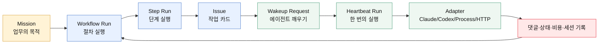

---

## 1. 한 줄 요약

> **워크플로우는 “업무 순서표”이고, 하트비트는 “에이전트를 깨우는 알람”입니다.**  
> 미션이 멈췄다면 순서표만 보거나 알람만 보면 안 됩니다. 둘 사이의 연결 기록을 같이 봐야 합니다.

### 사무실 비유

| Paperclip | 사무실 비유 |
| --- | --- |
| Mission | “오늘 안에 고객 제안서 완성” 같은 목표 |
| Workflow | 목표를 이루기 위한 체크리스트 |
| Step | “자료 조사”, “초안 작성”, “리뷰 반영” 같은 한 단계 |
| Issue | 담당자 책상 위에 놓인 작업 카드 |
| Heartbeat | 담당자에게 “지금 이 카드 처리해”라고 울리는 알람 |
| Adapter | 실제 담당자를 불러오는 전화기·메신저 |
| Reconciler | 퇴근 전, 멈춘 카드가 없는지 도는 관리자 |

초보자가 헷갈리는 지점은 여기입니다. Paperclip은 단순히 “한 프로세스를 실행하고 끝”이 아니라, **상태를 여러 테이블과 여러 루프에 나눠 저장**합니다. 그래서 장애를 볼 때도 한 화면만 보면 판단이 틀릴 수 있습니다.

---

## 2. 정상 흐름: 미션은 어떻게 움직이나?

아래는 가장 기본적인 흐름입니다.

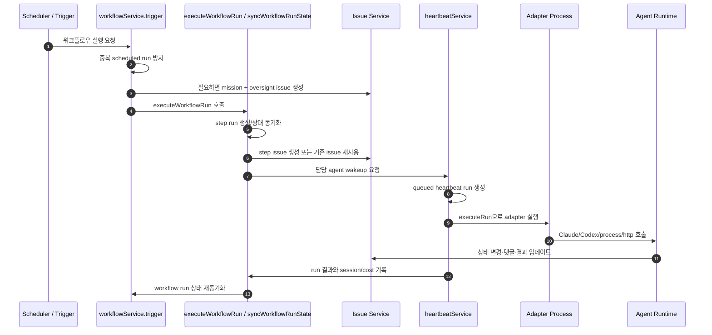

### 단계별로 풀어쓰기

#### 2-1. 트리거가 들어온다

`workflowService.trigger(...)`가 시작점입니다. 이 함수는 워크플로우 정의를 읽고, 실행 날짜(`runDate`)를 계산하고, 이미 같은 scheduled mission run이 돌고 있는지 확인합니다.

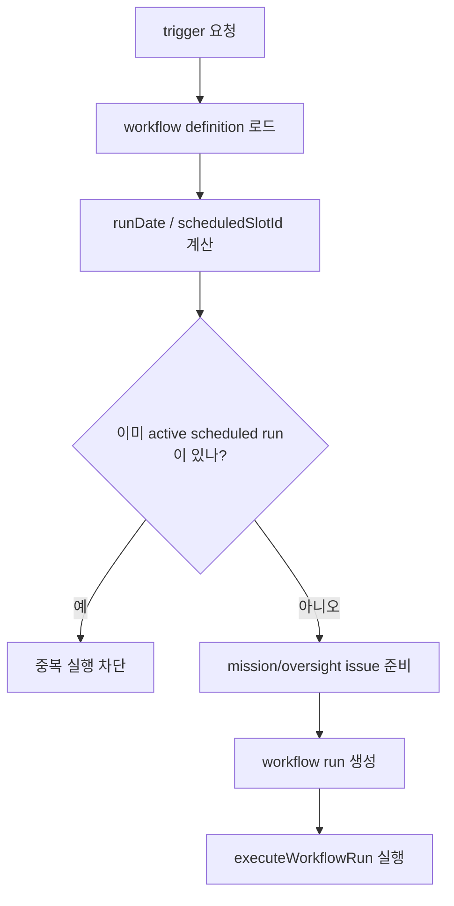

#### 2-2. 워크플로우가 step run을 만든다

`executeWorkflowRun(...)`은 workflow run을 `running`으로 바꾸고 `syncWorkflowRunState(...)`를 호출합니다. 여기서 실제 DAG가 움직입니다.

> **DAG (Directed Acyclic Graph, 방향성 비순환 그래프)**  
> 쉽게 말하면 “앞 단계가 끝나야 다음 단계로 가는 순서표”입니다. 화살표 방향은 있지만, 무한히 빙글빙글 도는 고리는 기본적으로 피합니다. Paperclip에는 rework/back-edge 같은 특수 흐름도 있어, 상태 동기화가 특히 중요합니다.

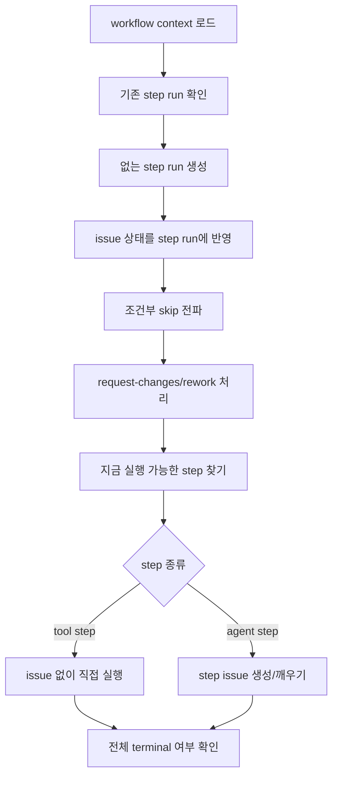

#### 2-3. Issue가 agent work로 바뀐다

Agent가 처리할 작업은 보통 issue로 표현됩니다. DAG가 “이 단계는 누가 해야 한다”고 판단하면 issue를 만들거나 기존 issue를 깨웁니다.

여기서부터는 `heartbeatService(...)`가 중심입니다.

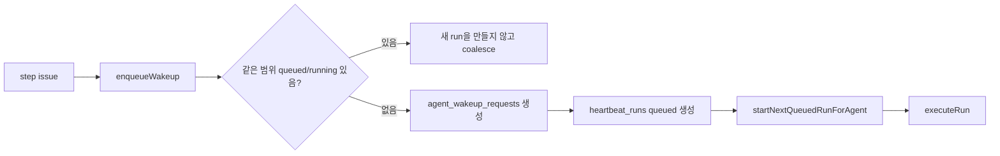

---

## 3. 하트비트는 왜 따로 있나?

워크플로우가 “무슨 일을 해야 하는지”를 정한다면, 하트비트는 “어떤 에이전트를 지금 깨워서 실행할지”를 정합니다.

### 하트비트 내부 흐름

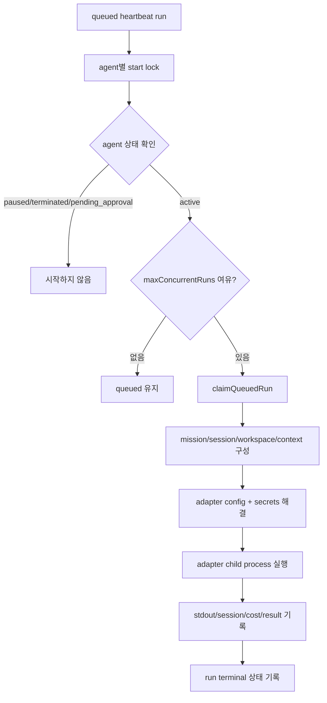

### 여기서 자주 생기는 오해

| 오해 | 실제 |
| --- | --- |
| wakeup 요청을 넣으면 무조건 새 실행이 생긴다 | 같은 범위의 queued/running run이 있으면 coalesce될 수 있습니다. |
| workflow run이 running이면 adapter도 반드시 실행 중이다 | 아닙니다. workflow run은 running인데 heartbeat는 끝났거나 대기 중일 수 있습니다. |
| issue가 done이면 모든 process가 종료됐다 | 아닙니다. adapter child가 exit하지 않아 `running`을 붙잡을 수 있습니다. |
| 한 테이블만 보면 원인을 알 수 있다 | 보통은 mission, workflow run, step run, issue, heartbeat run을 같이 봐야 합니다. |

### 플러그인 도구 호출 URL은 어디서 오나?

Agent가 Research Workbench 같은 plugin tool을 호출할 때는 `PAPERCLIP_API_BASE_URL/plugins/tools/execute`로 요청합니다. 이 값은 adapter가 임의로 `localhost:3200`을 추측하면 안 됩니다. 실행 직전 heartbeat가 현재 runtime의 control-plane URL을 run context에 넣고, adapter는 그 context 값을 최우선으로 환경변수에 주입합니다.

| 값 | 의미 | 예시 |
| --- | --- | --- |
| `paperclipApiUrl` | `/api`가 붙지 않은 runtime origin | `http://127.0.0.1:3100` |
| `paperclipApiBaseUrl` | agent/plugin 호출용 API base | `http://127.0.0.1:3100/api` |
| `PAPERCLIP_API_URL` | adapter child에게 전달되는 runtime origin | `http://127.0.0.1:3100` |
| `PAPERCLIP_API_BASE_URL` | adapter child가 plugin tool 실행에 쓰는 API base | `http://127.0.0.1:3100/api` |

다른 머신이나 다른 포트에 설치해도 이 값은 실행 시점의 runtime 설정에서 다시 계산됩니다. 따라서 adapter, plugin, agent instruction은 포트를 하드코딩하지 말고 `PAPERCLIP_API_BASE_URL`을 사용해야 합니다.

Plugin tool 실행 요청의 `runContext`는 agent가 직접 문자열을 만들기보다 환경변수를 그대로 써야 합니다.

```json
{
  "agentId": "$PAPERCLIP_AGENT_ID",
  "runId": "$PAPERCLIP_RUN_ID",
  "companyId": "$PAPERCLIP_COMPANY_ID"
}
```

`runId`나 `agentId`를 잘못 넣으면 host가 `Agent run context is not valid for tool execution`으로 막습니다. 이 오류는 URL 문제가 아니라 실행 권한 검증 실패입니다.

### Research Workbench는 언제 자동으로 붙나?

Research Workbench plugin이 `ready` 상태이고 `research-search` tool을 manifest에 선언하면, server-native PAQO workflow materialization이 검색/리서치 성격의 ACTION 또는 QA step에 `insightflo.research-workbench:research-search`를 자동으로 붙입니다.

반대로 plugin이 설치되지 않았거나 `ready`가 아니면 tool 이름을 가짜로 만들지 않습니다. 이 경우 planner/QA는 사용 가능한 skill, KB, core workflow tool만 기준으로 계획해야 하고, 검색이 필수인데 대체 수단이 없으면 해당 issue를 blocked로 처리해야 합니다.

### 상태가 나뉘는 이유

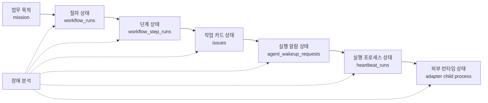

---

## 4. 복구 루프: 멈춘 상태는 누가 치우나?

Paperclip에는 크게 두 종류의 복구 루프가 있습니다.

### 4-1. Heartbeat recovery

`createHeartbeatScheduler(...)`는 세 가지 lane을 돌립니다.

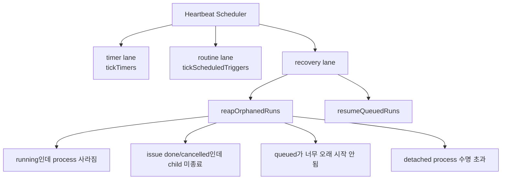

쉽게 말해 heartbeat recovery는 “에이전트 실행 알람과 process가 꼬였는지”를 봅니다.

### 4-2. Workflow recovery

`createNativeWorkflowReconciler(...)`는 workflow run 자체가 오래 `running`으로 남아 있는지 봅니다.

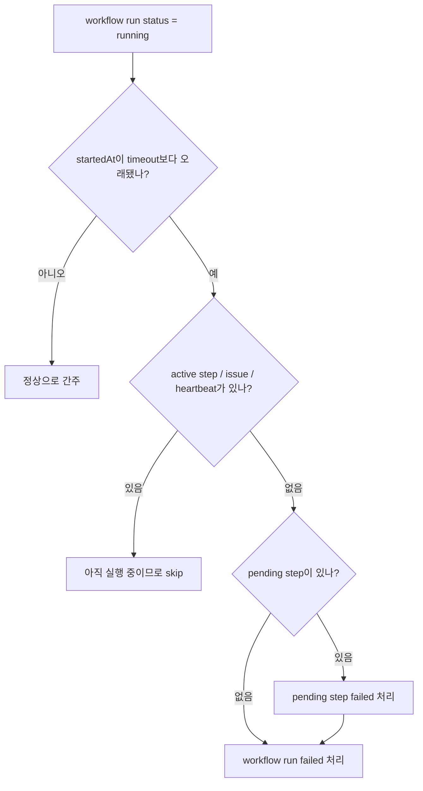

### 두 복구 루프의 차이

| 구분 | Heartbeat recovery | Workflow recovery |
| --- | --- | --- |
| 주로 보는 것 | `heartbeat_runs`, process, wakeup request | `workflow_runs`, `workflow_step_runs`, issue 연결 |
| 대표 함수 | `reapOrphanedRuns`, `resumeQueuedRuns` | `reconcileWorkflow`, `reconcileStuckWorkflowRuns` |
| 해결하는 문제 | adapter child가 안 죽음, queued가 안 시작됨, process lost | workflow run이 running으로 방치됨 |
| 주의점 | issue 상태와 process 상태가 어긋날 수 있음 | active step이 있으면 함부로 fail 처리하면 안 됨 |

---

## 5. 운영 매뉴얼: “미션이 안 움직인다”면 어디부터 보나?

아래 순서대로 보면 됩니다. 핵심은 **위에서 아래로 좁혀 가는 것**입니다.

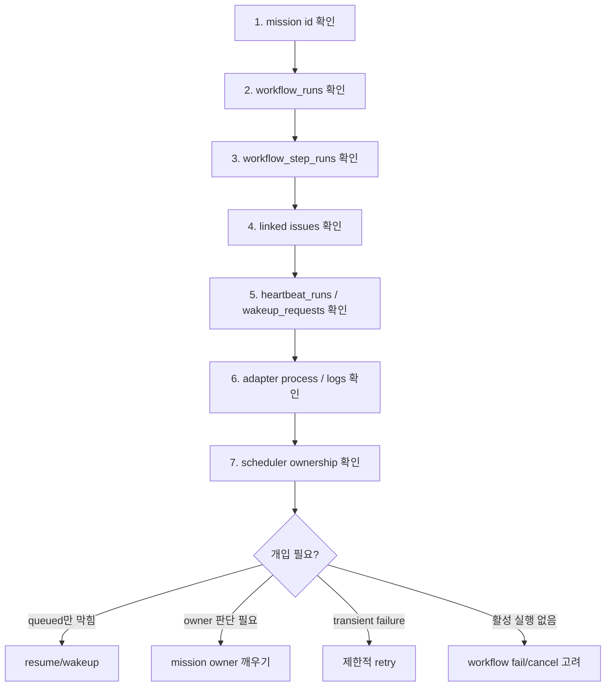

### Step 1. Mission과 workflow run을 먼저 본다

확인할 것:

- `workflow_runs.status`
- `workflow_runs.trigger_source`
- `workflow_runs.scheduled_slot_id`
- `workflow_runs.started_at`
- `workflow_runs.completed_at`

판단 기준:

| 보이는 상태 | 의미 |
| --- | --- |
| `running` + 최근 step/heartbeat 있음 | 정상 진행 중일 가능성이 큽니다. |
| `running` + 오래된 started_at + active step 없음 | workflow reconciler 대상입니다. |
| 같은 날짜·같은 scheduled slot에 active run 여러 개 | scheduler ownership 또는 duplicate guard를 의심합니다. |

### Step 2. Step run과 issue 연결을 본다

확인할 것:

- `workflow_step_runs.status`
- `workflow_step_runs.issue_id`
- `workflow_step_runs.iteration_index`
- linked issue의 `status`, `assignee_agent_id`, `mission_id`

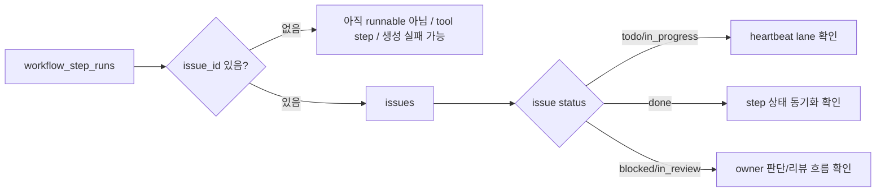

### Step 3. Heartbeat run을 본다

확인할 것:

- `heartbeat_runs.status`
- `heartbeat_runs.error_code`
- `agent_wakeup_requests.status`
- `process_pid`
- `session_id_before`, `session_id_after`
- run event/log

판단 기준:

| 보이는 상태 | 의심 지점 |
| --- | --- |
| `queued`인데 agent에 running run 없음 | `resumeQueuedRuns()` 또는 agent status 확인 |
| `running`인데 process handle 없음 | `process_detached`, `process_lost` 경로 |
| issue는 done인데 run은 running | adapter child 미종료 경로 |
| 반복 실패 후 fallback run 생성 | adapter fallback config와 원래 command 확인 |

### Step 4. Scheduler ownership을 본다

Paperclip은 native scheduler와 plugin workflow-engine 경계가 있습니다. 여기서 소유권이 어긋나면 중복 실행 또는 미복구가 생길 수 있습니다.

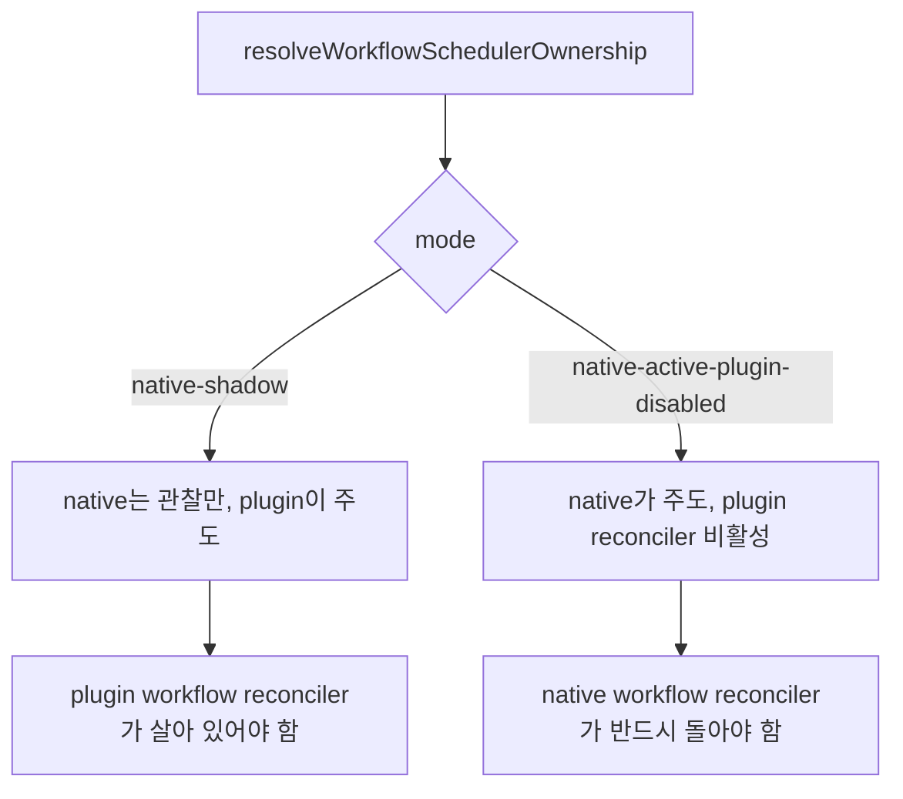

---

## 6. 흔한 장애 모양 5가지

### 장애 1. queued인데 시작하지 않음

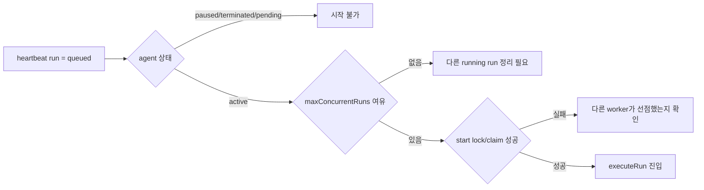

**관련 코드**: `startNextQueuedRunForAgent(...)`, `resumeQueuedRuns()`, `reapOrphanedRuns(...)`

### 장애 2. issue는 done인데 process가 계속 살아 있음

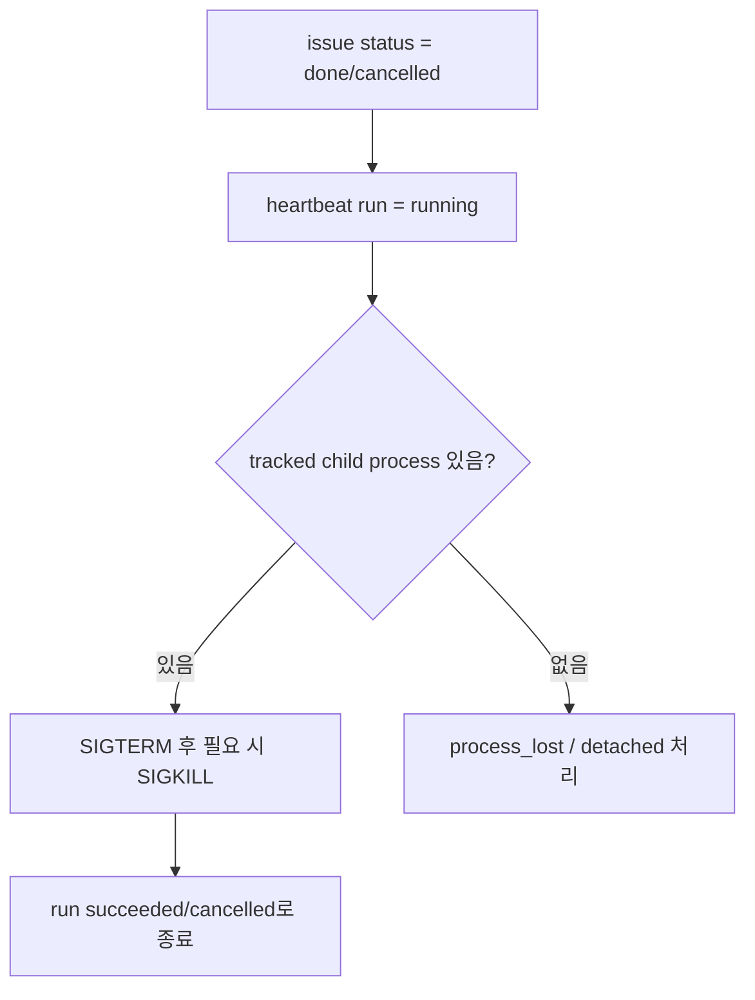

**관련 코드**: `reapOrphanedRuns(...)`의 issue done/cancelled child termination 경로

### 장애 3. workflow run이 failed step 뒤에도 running으로 남음

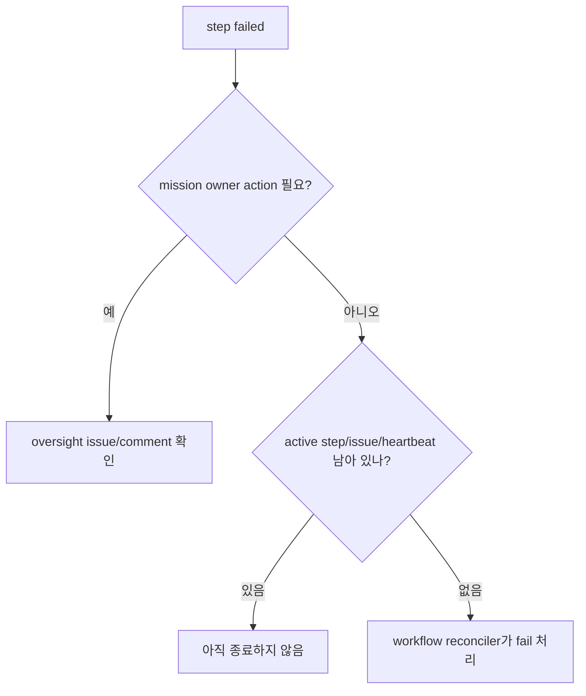

**관련 코드**: `syncWorkflowRunState(...)`, `commentOnMainExecutorOversightForFailures(...)`, `createNativeWorkflowReconciler(...)`

### 장애 4. 같은 scheduled mission이 중복 실행됨

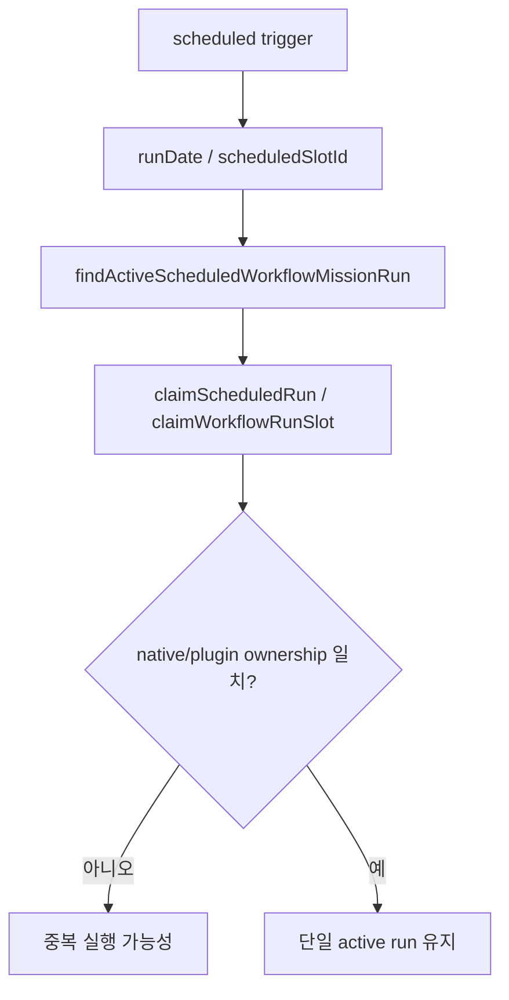

**관련 코드**: `assertNoImplicitDuplicateScheduledWorkflowRun(...)`, `findActiveScheduledWorkflowMissionRun(...)`, `claimScheduledRun(...)`

### 장애 5. 미션 세션과 작업 세션이 꼬임

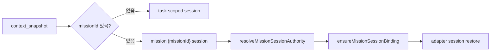

**관련 코드**: `resolveMissionSessionAuthority(...)`, `ensureMissionSessionBinding(...)`, `executeRun(...)`

---

## 7. GraphRAG로 확인한 코드 연결

이번 분석에서 graphify로 만든 그래프는 runtime 관련 코드와 문서의 연결을 뽑은 것입니다.

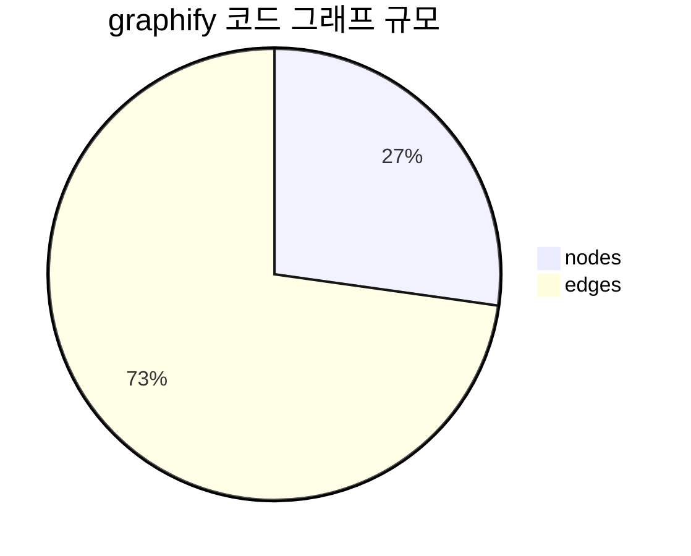

### 주요 발견

| 확인한 노드 | 위치 | 연결 의미 |
| --- | --- | --- |
| `executeWorkflowRun()` | `server/src/services/workflow/dag-engine.ts` | workflow run을 실제 DAG 실행으로 넘깁니다. |
| `syncWorkflowRunState()` | `server/src/services/workflow/dag-engine.ts` | step 상태, issue 상태, terminal 여부를 동기화합니다. |
| `workflowService` | `server/src/services/workflow/engine.ts` | trigger, route, plugin host, scheduler에서 불립니다. |
| `heartbeatService()` | `server/src/services/heartbeat.ts` | app, routes, plugin host, routines, workflow DAG engine과 연결됩니다. |
| `createNativeWorkflowReconciler()` | `server/src/services/workflow/reconciler.ts` | native ownership에서 stuck workflow run을 정리합니다. |

### SocratiCode 상태

| 항목 | 결과 |
| --- | --- |
| MCP server 실행 | `npx -y socraticode`로 도구 검색 성공 |
| health check | Docker missing 보고 |
| graph build | 요청은 가능했지만 TypeScript graph는 생성되지 않음 |
| 대체 수단 | graphify로 local code graph 생성 |

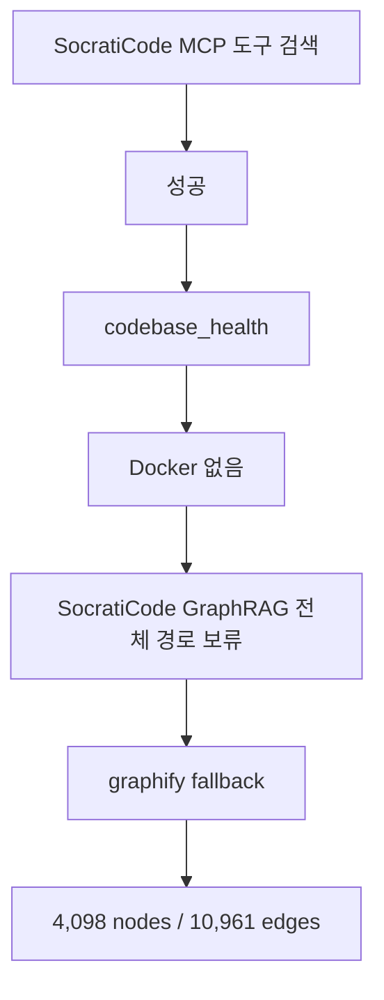

---

## 8. 지식 만화로 한 번 더 이해하기

| 1컷: 문제 | 2컷: 발견 | 3컷: 작동 | 4컷: 주의 |
| --- | --- | --- | --- |
| 🧑‍💻 “미션이 멈췄는데 어디를 봐야 하지?” | 🗺️ “미션은 목표이고, workflow는 순서표구나.” | ⏰ “heartbeat가 agent를 깨워 issue를 처리하게 하는구나.” | 👀 “한 테이블만 보면 착각한다. 여러 상태를 같이 봐야 한다.” |
| mission만 보면 process가 안 보입니다. | workflow run과 step run이 중간 다리입니다. | adapter child process가 실제 실행을 담당합니다. | recovery와 scheduler ownership까지 확인해야 합니다. |

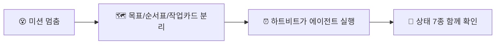

---

## 9. 바로 쓰는 점검표

미션이 멈춘 것 같으면 아래 순서만 따라가도 원인을 많이 좁힐 수 있습니다.

1. **mission id를 먼저 고정합니다.** 이름이나 날짜로만 보지 말고 실제 id를 잡습니다.
2. **workflow run 상태를 봅니다.** `running`인지, `failed`인지, `completed`인지 확인합니다.
3. **step run을 봅니다.** 어떤 step이 `pending`, `running`, `failed`인지 확인합니다.
4. **linked issue를 봅니다.** `todo`, `in_progress`, `done`, `blocked`, `in_review` 중 어디인지 봅니다.
5. **heartbeat run을 봅니다.** `queued`, `running`, `failed`, `timed_out` 중 어디인지 봅니다.
6. **adapter process를 봅니다.** issue는 끝났는데 child process가 살아 있는지 확인합니다.
7. **scheduler ownership을 봅니다.** native와 plugin 중 누가 주도권을 갖는지 확인합니다.
8. **개입은 작게 합니다.** 무작정 workflow를 cancel하지 말고, queued resume → owner wakeup → 제한적 retry → fail/cancel 순서로 접근합니다.

### 마지막 핵심

> Paperclip runtime 장애는 보통 “한 줄 버그”가 아니라 **상태 동기화 문제**입니다.  
> 그래서 좋은 운영자는 한 테이블을 깊게 보는 사람보다, **mission → workflow run → step run → issue → wakeup → heartbeat → adapter**를 한 번에 이어 보는 사람입니다.

---

## 재실행 명령

분석을 다시 하고 싶을 때의 명령입니다.

```bash
# SocratiCode 도구 검색
npx -y mcporter list --stdio "npx -y socraticode" --name socraticode --schema --output json

# SocratiCode health check
npx -y mcporter call --stdio "npx -y socraticode" codebase_health --output json

# Docker가 준비된 뒤 SocratiCode graph build
npx -y mcporter call --stdio "npx -y socraticode" codebase_graph_build \
  --args '{"projectPath":"/absolute/path/to/papercompany-runtime"}' \
  --output json

# graphify fallback
python3 -m venv /tmp/graphify-venv
/tmp/graphify-venv/bin/pip install graphifyy
/tmp/graphify-venv/bin/graphify extract /tmp/pc-code-corpus \
  --out /tmp/pc-graphify-code/graphify-out \
  --no-cluster
/tmp/graphify-venv/bin/graphify explain "executeWorkflowRun()" \
  --graph /tmp/pc-graphify-code/graphify-out/graph.json
/tmp/graphify-venv/bin/graphify explain "heartbeatService()" \
  --graph /tmp/pc-graphify-code/graphify-out/graph.json
```
