This guide explains how **missions** run inside papercompany: why a mission can appear stuck, how **workflows** and **heartbeats** connect, and where an operator should look first. It is written so a beginner can follow along.

## Core idea

> **A mission is not one process.**  
> A single mission can contain multiple workflow runs, step runs, issues, heartbeat runs, and adapter processes.

| Term | Plain meaning | Code location |
| --- | --- | --- |
| **Mission** | A bundle of work to accomplish. The unit of "why". | `server/src/services/missions.ts` |
| **Workflow run** | One execution of a workflow definition. | `server/src/services/workflow/engine.ts` |
| **Step run** | One step executed inside a workflow. | `server/src/services/workflow/dag-engine.ts` |
| **Issue** | The work card an agent actually picks up and processes. | `server/src/services/issues.ts` |
| **Heartbeat run** | A single run that wakes an agent and makes it work. | `server/src/services/heartbeat.ts` |
| **Adapter** | The connector that invokes a real runner (Claude, Codex, process, HTTP, etc.). | `server/src/adapters/*`, `packages/adapters/*` |
| **Reconciler** | The recovery loop that finds and cleans up stuck runs. | `server/src/services/workflow/reconciler.ts` |

### One-picture overview

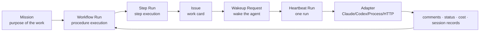
```mermaid
flowchart LR
  Mission["Mission\npurpose of the work"] --> WorkflowRun["Workflow Run\nprocedure execution"]
  WorkflowRun --> StepRun["Step Run\nstep execution"]
  StepRun --> Issue["Issue\nwork card"]
  Issue --> Wakeup["Wakeup Request\nwake the agent"]
  Wakeup --> Heartbeat["Heartbeat Run\none run"]
  Heartbeat --> Adapter["Adapter\nClaude/Codex/Process/HTTP"]
  Adapter --> Result["comments · status · cost · session records"]
  Result --> WorkflowRun
```

## One-line summary

> **A workflow is the "order of operations"; a heartbeat is the "alarm that wakes the agent".**  
> If a mission is stuck, do not look only at the order of operations or only at the alarm — look at the connection records between them.

### Office analogy

| papercompany | Office analogy |
| --- | --- |
| Mission | "Finish the client proposal today" |
| Workflow | A checklist for the goal |
| Step | One checklist item: research, draft, review |
| Issue | The work card on the assignee's desk |
| Heartbeat | The alarm saying "handle this card now" |
| Adapter | The phone/messenger that actually reaches the assignee |
| Reconciler | The manager who checks for stuck cards before leaving |

papercompany does not simply "run one process and finish". It **stores state across multiple tables and loops**, so troubleshooting from a single screen can mislead you.

## Normal flow: how a mission moves

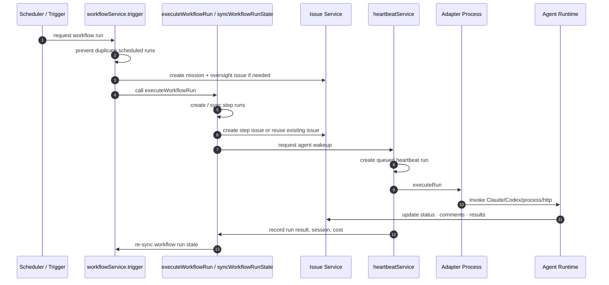
```mermaid
sequenceDiagram
  autonumber
  participant Scheduler as Scheduler / Trigger
  participant Workflow as workflowService.trigger
  participant DAG as executeWorkflowRun / syncWorkflowRunState
  participant Issue as Issue Service
  participant HB as heartbeatService
  participant Adapter as Adapter Process
  participant Agent as Agent Runtime

  Scheduler->>Workflow: request workflow run
  Workflow->>Workflow: prevent duplicate scheduled runs
  Workflow->>Issue: create mission + oversight issue if needed
  Workflow->>DAG: call executeWorkflowRun
  DAG->>DAG: create / sync step runs
  DAG->>Issue: create step issue or reuse existing issue
  DAG->>HB: request agent wakeup
  HB->>HB: create queued heartbeat run
  HB->>Adapter: executeRun
  Adapter->>Agent: invoke Claude/Codex/process/http
  Agent->>Issue: update status · comments · results
  HB->>DAG: record run result, session, cost
  DAG->>Workflow: re-sync workflow run state
```

### Step by step

#### 1. A trigger arrives

`workflowService.trigger(...)` is the entry point. It loads the workflow definition, computes the run date, and checks whether the same scheduled mission run is already active.

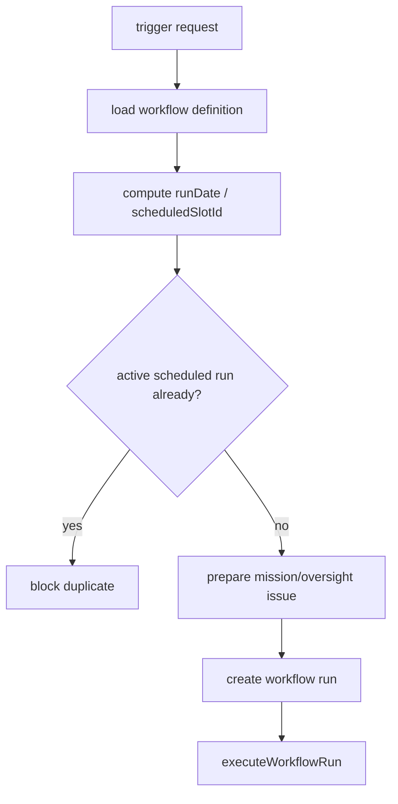
```mermaid
flowchart TD
  A["trigger request"] --> B["load workflow definition"]
  B --> C["compute runDate / scheduledSlotId"]
  C --> D{"active scheduled run already?"}
  D -- yes --> E["block duplicate"]
  D -- no --> F["prepare mission/oversight issue"]
  F --> G["create workflow run"]
  G --> H["executeWorkflowRun"]
```

#### 2. The workflow creates step runs

`executeWorkflowRun(...)` marks the workflow run as `running` and calls `syncWorkflowRunState(...)`, which drives the DAG.

> **DAG (Directed Acyclic Graph)** — a "sequence where a step finishes before the next starts". papercompany also has special flows like rework/back-edges, which makes state synchronization especially important.

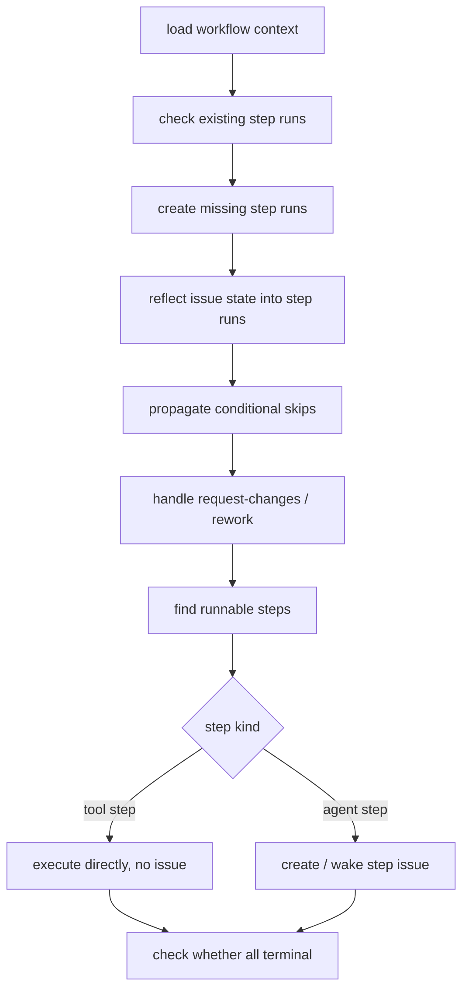
```mermaid
flowchart TD
  Load["load workflow context"] --> Existing["check existing step runs"]
  Existing --> Missing["create missing step runs"]
  Missing --> Sync["reflect issue state into step runs"]
  Sync --> Skip["propagate conditional skips"]
  Skip --> Rework["handle request-changes / rework"]
  Rework --> Runnable["find runnable steps"]
  Runnable --> Kind{"step kind"}
  Kind -- "tool step" --> Tool["execute directly, no issue"]
  Kind -- "agent step" --> Issue["create / wake step issue"]
  Tool --> Finalize["check whether all terminal"]
  Issue --> Finalize
```

#### 3. An issue becomes agent work

Work an agent must process is usually expressed as an issue. When the DAG decides "this step needs an agent", it creates an issue or wakes an existing one. From here, `heartbeatService(...)` takes over.

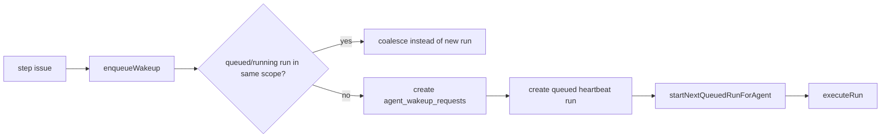
```mermaid
flowchart LR
  Issue["step issue"] --> Wake["enqueueWakeup"]
  Wake --> Coalesce{"queued/running run in same scope?"}
  Coalesce -- yes --> Reuse["coalesce instead of new run"]
  Coalesce -- no --> Request["create agent_wakeup_requests"]
  Request --> Run["create queued heartbeat run"]
  Run --> Start["startNextQueuedRunForAgent"]
  Start --> Execute["executeRun"]
```

## Why does the heartbeat exist separately?

The workflow decides **what work to do**; the heartbeat decides **which agent to wake right now**.

### Heartbeat internals

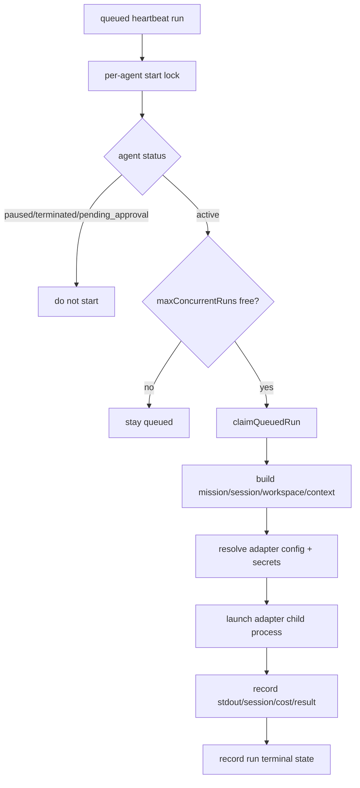
```mermaid
flowchart TD
  Q["queued heartbeat run"] --> Lock["per-agent start lock"]
  Lock --> AgentStatus{"agent status"}
  AgentStatus -- "paused/terminated/pending_approval" --> Stop["do not start"]
  AgentStatus -- "active" --> Slots{"maxConcurrentRuns free?"}
  Slots -- no --> Wait["stay queued"]
  Slots -- yes --> Claim["claimQueuedRun"]
  Claim --> Context["build mission/session/workspace/context"]
  Context --> AdapterConfig["resolve adapter config + secrets"]
  AdapterConfig --> Launch["launch adapter child process"]
  Launch --> Capture["record stdout/session/cost/result"]
  Capture --> Finish["record run terminal state"]
```

### Common misconceptions

| Misconception | Reality |
| --- | --- |
| A wakeup request always creates a new run | It can be coalesced if a queued/running run exists in the same scope. |
| A running workflow run means the adapter is executing | Not necessarily — the workflow run can be `running` while the heartbeat has finished or is waiting. |
| A `done` issue means all processes ended | Not necessarily — an adapter child may not have exited and can hold `running`. |
| One table is enough to find the cause | Usually you must inspect mission, workflow run, step run, issue, and heartbeat run together. |

### Plugin tool invocation URLs

When an agent calls a plugin tool (such as Research Workbench), it requests `PAPERCLIP_API_BASE_URL/plugins/tools/execute`. The adapter must not guess a port; right before execution the heartbeat puts the current control-plane URL into the run context, and the adapter injects that value into the environment with highest priority.

| Value | Meaning | Example |
| --- | --- | --- |
| `paperclipApiUrl` | Runtime origin without `/api` | `http://127.0.0.1:3200` |
| `paperclipApiBaseUrl` | API base for agent/plugin calls | `http://127.0.0.1:3200/api` |
| `PAPERCLIP_API_URL` | Runtime origin passed to the adapter child | `http://127.0.0.1:3200` |
| `PAPERCLIP_API_BASE_URL` | API base the adapter child uses for plugin tools | `http://127.0.0.1:3200/api` |

These values are recomputed from runtime settings at execution time, so adapters, plugins, and agent instructions should use `PAPERCLIP_API_BASE_URL` instead of hardcoding a port.

Plugin tool execution requests should use the environment variables directly rather than hand-built strings:

```json
{
  "agentId": "$PAPERCLIP_AGENT_ID",
  "runId": "$PAPERCLIP_RUN_ID",
  "companyId": "$PAPERCLIP_COMPANY_ID"
}
```

If `runId` or `agentId` is wrong, the host blocks the call with `Agent run context is not valid for tool execution` — this is an authorization failure, not a URL problem.

### Why state is split

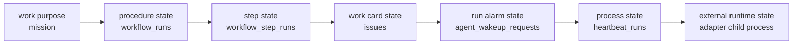
```mermaid
flowchart LR
  A["work purpose\nmission"] --> B["procedure state\nworkflow_runs"]
  B --> C["step state\nworkflow_step_runs"]
  C --> D["work card state\nissues"]
  D --> E["run alarm state\nagent_wakeup_requests"]
  E --> F["process state\nheartbeat_runs"]
  F --> G["external runtime state\nadapter child process"]
```

## Recovery loops: who cleans up stuck state?

papercompany has two kinds of recovery loops.

### Heartbeat recovery

`createHeartbeatScheduler(...)` runs three lanes:

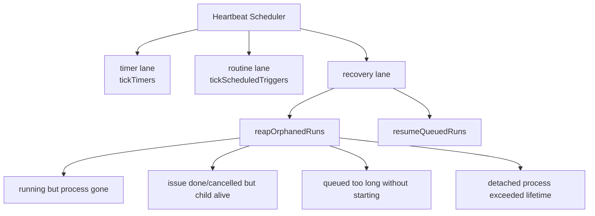
```mermaid
flowchart TD
  Scheduler["Heartbeat Scheduler"] --> Timer["timer lane\ntickTimers"]
  Scheduler --> Routine["routine lane\ntickScheduledTriggers"]
  Scheduler --> Recovery["recovery lane"]
  Recovery --> Reap["reapOrphanedRuns"]
  Recovery --> Resume["resumeQueuedRuns"]

  Reap --> A["running but process gone"]
  Reap --> B["issue done/cancelled but child alive"]
  Reap --> C["queued too long without starting"]
  Reap --> D["detached process exceeded lifetime"]
```

Heartbeat recovery looks at whether agent run alarms and processes are tangled.

### Workflow recovery

`createNativeWorkflowReconciler(...)` looks at whether a workflow run has been `running` for too long:

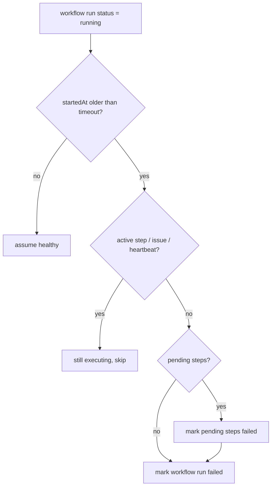
```mermaid
flowchart TD
  Start["workflow run status = running"] --> Timeout{"startedAt older than timeout?"}
  Timeout -- no --> Skip1["assume healthy"]
  Timeout -- yes --> Active{"active step / issue / heartbeat?"}
  Active -- yes --> Skip2["still executing, skip"]
  Active -- no --> Pending{"pending steps?"}
  Pending -- yes --> FailSteps["mark pending steps failed"]
  Pending -- no --> FailRun["mark workflow run failed"]
  FailSteps --> FailRun
```

### Difference between the two loops

| Aspect | Heartbeat recovery | Workflow recovery |
| --- | --- | --- |
| Watches | `heartbeat_runs`, processes, wakeup requests | `workflow_runs`, `workflow_step_runs`, issue links |
| Key functions | `reapOrphanedRuns`, `resumeQueuedRuns` | `reconcileWorkflow`, `reconcileStuckWorkflowRuns` |
| Fixes | adapter child not exiting, queued never starting, lost processes | workflow run left `running` |
| Caution | issue state and process state can diverge | never fail a run while active steps exist |

## Operator manual: "the mission is not moving" — where to look

Narrow from top to bottom:

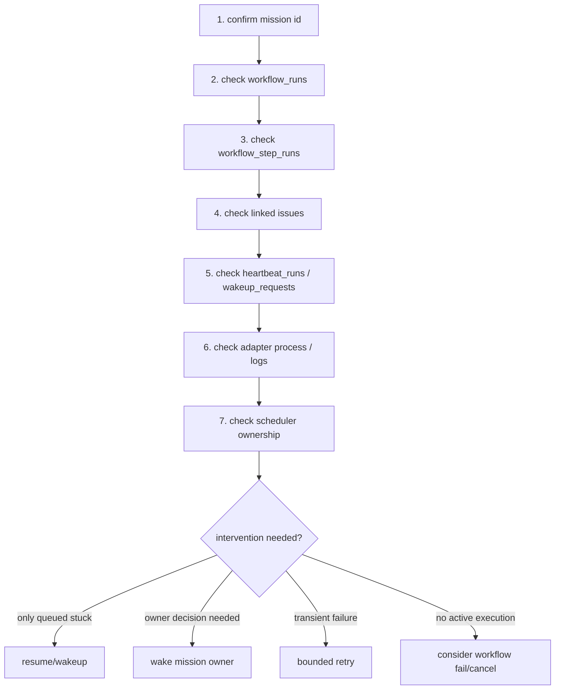
```mermaid
flowchart TD
  M["1. confirm mission id"] --> W["2. check workflow_runs"]
  W --> S["3. check workflow_step_runs"]
  S --> I["4. check linked issues"]
  I --> H["5. check heartbeat_runs / wakeup_requests"]
  H --> P["6. check adapter process / logs"]
  P --> O["7. check scheduler ownership"]
  O --> D{"intervention needed?"}
  D -- "only queued stuck" --> A["resume/wakeup"]
  D -- "owner decision needed" --> B["wake mission owner"]
  D -- "transient failure" --> C["bounded retry"]
  D -- "no active execution" --> E["consider workflow fail/cancel"]
```

### Step 1. Look at the mission and workflow run first

Check:

- `workflow_runs.status`
- `workflow_runs.trigger_source`
- `workflow_runs.scheduled_slot_id`
- `workflow_runs.started_at`
- `workflow_runs.completed_at`

| What you see | Meaning |
| --- | --- |
| `running` + recent steps/heartbeats | Likely healthy progress. |
| `running` + old started_at + no active steps | A workflow reconciler target. |
| Multiple active runs for the same date and scheduled slot | Suspect scheduler ownership or duplicate guard issues. |

### Step 2. Look at step runs and issue links

Check:

- `workflow_step_runs.status`
- `workflow_step_runs.issue_id`
- `workflow_step_runs.iteration_index`
- linked issue `status`, `assignee_agent_id`, `mission_id`

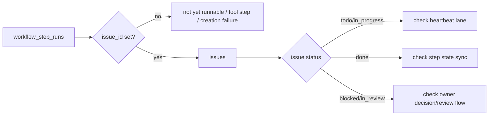
```mermaid
flowchart LR
  StepRun["workflow_step_runs"] --> HasIssue{"issue_id set?"}
  HasIssue -- no --> A["not yet runnable / tool step / creation failure"]
  HasIssue -- yes --> Issue["issues"]
  Issue --> Status{"issue status"}
  Status -- "todo/in_progress" --> HB["check heartbeat lane"]
  Status -- "done" --> Sync["check step state sync"]
  Status -- "blocked/in_review" --> Owner["check owner decision/review flow"]
```

### Step 3. Look at heartbeat runs

Check:

- `heartbeat_runs.status`
- `heartbeat_runs.error_code`
- `agent_wakeup_requests.status`
- `process_pid`
- `session_id_before`, `session_id_after`
- run events/logs

| What you see | Suspect |
| --- | --- |
| `queued` but no running run for the agent | `resumeQueuedRuns()` or agent status |
| `running` but no process handle | `process_detached`, `process_lost` paths |
| issue `done` but run still `running` | adapter child not exiting |
| fallback run after repeated failures | adapter fallback config and original command |

### Step 4. Check scheduler ownership

papercompany has a boundary between the native scheduler and the plugin workflow engine. When ownership is misaligned, duplicate runs or missed recovery can occur.

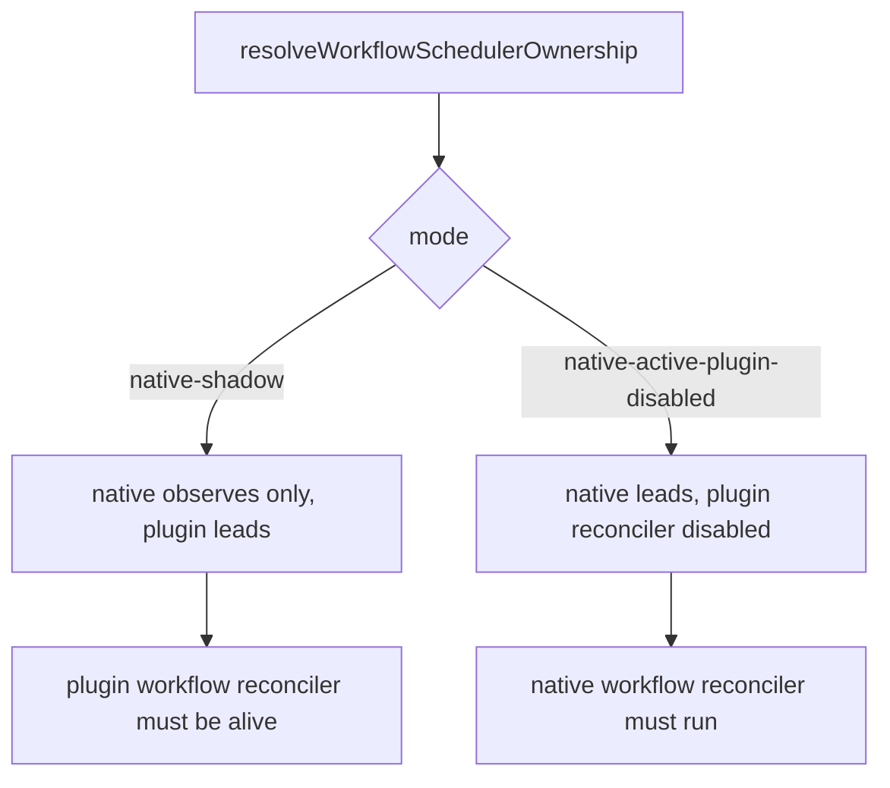
```mermaid
flowchart TD
  Ownership["resolveWorkflowSchedulerOwnership"] --> Mode{"mode"}
  Mode -- "native-shadow" --> Shadow["native observes only, plugin leads"]
  Mode -- "native-active-plugin-disabled" --> Native["native leads, plugin reconciler disabled"]
  Native --> NeedNativeReconciler["native workflow reconciler must run"]
  Shadow --> NeedPlugin["plugin workflow reconciler must be alive"]
```

## Five common failure shapes

### Failure 1. Queued but never starts

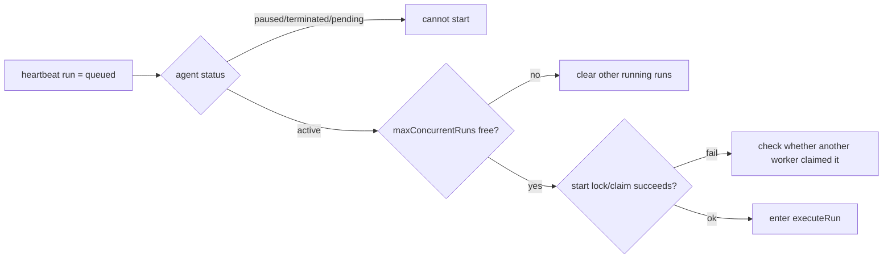
```mermaid
flowchart LR
  Q["heartbeat run = queued"] --> A{"agent status"}
  A -- paused/terminated/pending --> Stop["cannot start"]
  A -- active --> B{"maxConcurrentRuns free?"}
  B -- no --> Wait["clear other running runs"]
  B -- yes --> C{"start lock/claim succeeds?"}
  C -- fail --> Retry["check whether another worker claimed it"]
  C -- ok --> Run["enter executeRun"]
```

**Code**: `startNextQueuedRunForAgent(...)`, `resumeQueuedRuns()`, `reapOrphanedRuns(...)`

### Failure 2. Issue is done but the process is still alive

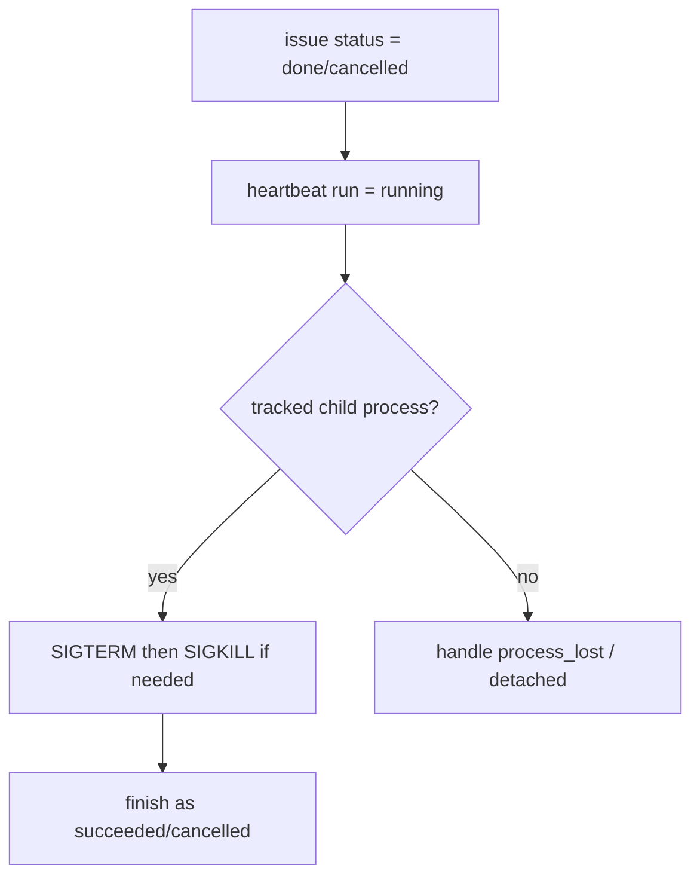
```mermaid
flowchart TD
  Done["issue status = done/cancelled"] --> Run["heartbeat run = running"]
  Run --> Child{"tracked child process?"}
  Child -- yes --> Kill["SIGTERM then SIGKILL if needed"]
  Kill --> Terminal["finish as succeeded/cancelled"]
  Child -- no --> Lost["handle process_lost / detached"]
```

**Code**: the issue done/cancelled child termination path in `reapOrphanedRuns(...)`

### Failure 3. Workflow run stays running after a failed step

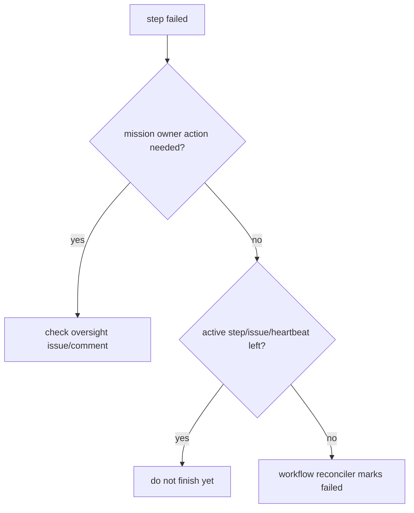
```mermaid
flowchart TD
  FailedStep["step failed"] --> Owner{"mission owner action needed?"}
  Owner -- yes --> Oversight["check oversight issue/comment"]
  Owner -- no --> Active{"active step/issue/heartbeat left?"}
  Active -- yes --> Wait["do not finish yet"]
  Active -- no --> Reconcile["workflow reconciler marks failed"]
```

**Code**: `syncWorkflowRunState(...)`, `commentOnMainExecutorOversightForFailures(...)`, `createNativeWorkflowReconciler(...)`

### Failure 4. The same scheduled mission runs twice

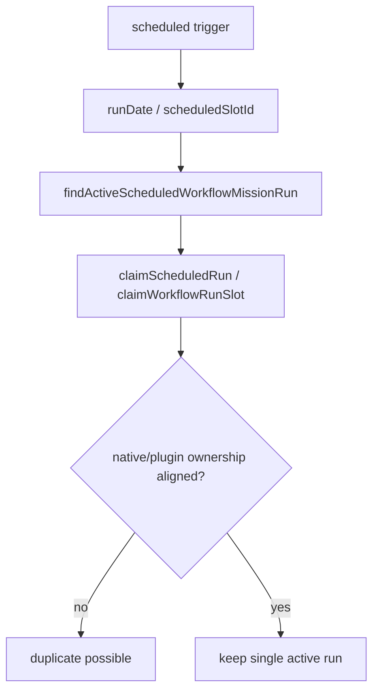
```mermaid
flowchart TD
  Trigger["scheduled trigger"] --> Slot["runDate / scheduledSlotId"]
  Slot --> Guard["findActiveScheduledWorkflowMissionRun"]
  Guard --> Claim["claimScheduledRun / claimWorkflowRunSlot"]
  Claim --> Ownership{"native/plugin ownership aligned?"}
  Ownership -- no --> Dup["duplicate possible"]
  Ownership -- yes --> Single["keep single active run"]
```

**Code**: `assertNoImplicitDuplicateScheduledWorkflowRun(...)`, `findActiveScheduledWorkflowMissionRun(...)`, `claimScheduledRun(...)`

### Failure 5. Mission session and task session are tangled

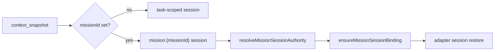
```mermaid
flowchart LR
  Context["context_snapshot"] --> MissionId{"missionId set?"}
  MissionId -- no --> TaskSession["task-scoped session"]
  MissionId -- yes --> MissionSession["mission:{missionId} session"]
  MissionSession --> Authority["resolveMissionSessionAuthority"]
  Authority --> Binding["ensureMissionSessionBinding"]
  Binding --> Adapter["adapter session restore"]
```

**Code**: `resolveMissionSessionAuthority(...)`, `ensureMissionSessionBinding(...)`, `executeRun(...)`

## Ready-to-use checklist

When a mission seems stuck, follow this order:

1. **Fix the mission id first.** Do not rely on name or date; pin the actual id.
2. **Look at the workflow run state.** `running`, `failed`, or `completed`.
3. **Look at step runs.** Which step is `pending`, `running`, or `failed`.
4. **Look at linked issues.** `todo`, `in_progress`, `done`, `blocked`, or `in_review`.
5. **Look at heartbeat runs.** `queued`, `running`, `failed`, or `timed_out`.
6. **Look at the adapter process.** Check whether the child process is still alive after the issue is done.
7. **Check scheduler ownership.** Whether native or plugin owns the schedule.
8. **Intervene minimally.** Do not cancel a workflow arbitrarily — proceed in order: queued resume → owner wakeup → bounded retry → fail/cancel.

### Key takeaway

> papercompany runtime failures are usually not a "one-line bug" — they are **state synchronization problems**.  
> A good operator does not stare at one table; they trace **mission → workflow run → step run → issue → wakeup → heartbeat → adapter** as one chain.
