이 가이드는 papercompany 안에서 **미션**이 어떻게 실행되는지 설명합니다: 미션이 멈춘 것처럼 보이는 이유, **워크플로**와 **하트비트**가 어떻게 연결되는지, 그리고 운영자가 먼저 어디를 봐야 하는지. 초보자도 따라갈 수 있게 작성되었습니다.

## 핵심 개념(Core idea)

> **미션은 하나의 프로세스가 아닙니다.**  
> 단일 미션은 여러 워크플로 런, 스텝 런, 이슈, 하트비트 런, 어댑터 프로세스를 포함할 수 있습니다.

| 용어(Term) | 쉬운 의미(Plain meaning) | 코드 위치(Code location) |
| --- | --- | --- |
| **미션(Mission)** | 완료해야 할 작업 묶음. "왜(why)"의 단위. | `server/src/services/missions.ts` |
| **워크플로 런(Workflow run)** | 워크플로 정의의 한 번의 실행. | `server/src/services/workflow/engine.ts` |
| **스텝 런(Step run)** | 워크플로 안에서 실행된 한 스텝. | `server/src/services/workflow/dag-engine.ts` |
| **이슈(Issue)** | 에이전트가 실제로 집어 들고 처리하는 작업 카드. | `server/src/services/issues.ts` |
| **하트비트 런(Heartbeat run)** | 에이전트를 깨워 일하게 만드는 한 번의 런. | `server/src/services/heartbeat.ts` |
| **어댑터(Adapter)** | 실제 러너(Claude, Codex, process, HTTP 등)를 호출하는 커넥터. | `server/src/adapters/*`, `packages/adapters/*` |
| **리컨실러(Reconciler)** | 멈춘 런을 찾아 정리하는 복구 루프. | `server/src/services/workflow/reconciler.ts` |

### 한눈에 보는 개요(One-picture overview)

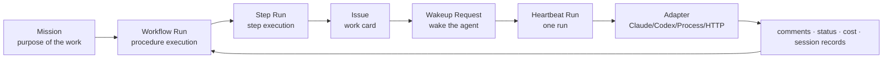

## 한 줄 요약(One-line summary)

> **워크플로는 "작업 순서"이고, 하트비트는 "에이전트를 깨우는 알람"입니다.**  
> 미션이 멈춘 것 같으면 작업 순서만 보거나 알람만 보지 말고, 둘 사이의 연결 기록을 보세요.

### 오피스 비유(Office analogy)

| papercompany | 오피스 비유(Office analogy) |
| --- | --- |
| 미션(Mission) | "오늘 클라이언트 제안서를 끝내라" |
| 워크플로(Workflow) | 목표를 위한 체크리스트 |
| 스텝(Step) | 체크리스트 항목 하나: 조사, 초안, 검토 |
| 이슈(Issue) | 담당자 책상 위의 작업 카드 |
| 하트비트(Heartbeat) | "지금 이 카드를 처리하라"는 알람 |
| 어댑터(Adapter) | 담당자에게 실제로 닿는 전화/메신저 |
| 리컨실러(Reconciler) | 퇴근 전에 멈춘 카드가 없는지 확인하는 매니저 |

papercompany는 단순히 "하나의 프로세스를 실행하고 끝내는" 것이 아닙니다. **여러 테이블과 루프에 걸쳐 상태를 저장**하므로, 단일 화면만으로 문제를 진단하면 오해할 수 있습니다.

## 정상 흐름: 미션이 움직이는 방식(Normal flow)

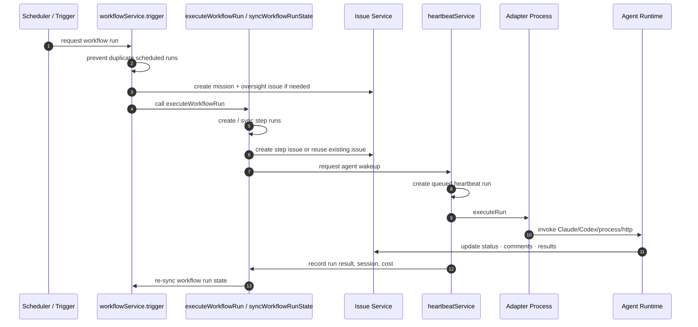

### 단계별 설명(Step by step)

#### 1. 트리거 도착

`workflowService.trigger(...)`가 진입점입니다. 워크플로 정의를 로드하고, 런 날짜를 계산하며, 같은 예약 미션 런이 이미 활성화되어 있는지 확인합니다.

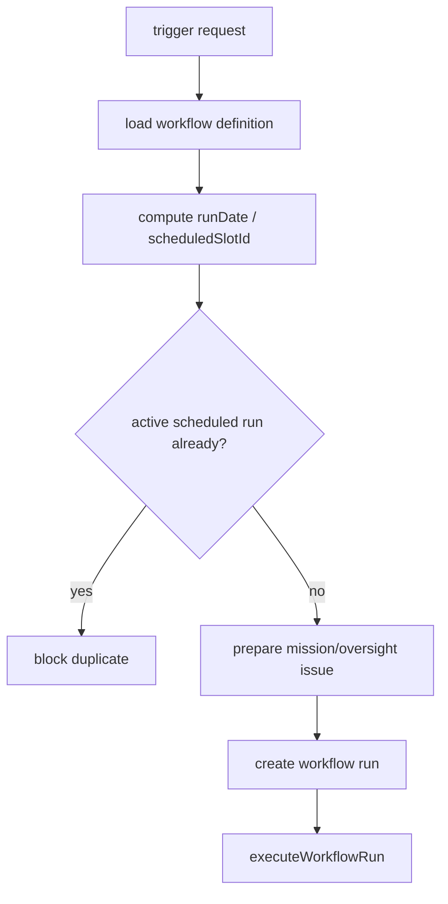

#### 2. 워크플로가 스텝 런 생성

`executeWorkflowRun(...)`는 워크플로 런을 `running`으로 표시하고 DAG를 구동하는 `syncWorkflowRunState(...)`를 호출합니다.

> **DAG(Directed Acyclic Graph, 방향성 비순환 그래프)** — "한 스텝이 끝나야 다음이 시작되는 순서". papercompany에는 리워크/백 엣지(rework/back-edge) 같은 특수 흐름도 있어서 상태 동기화가 특히 중요합니다.

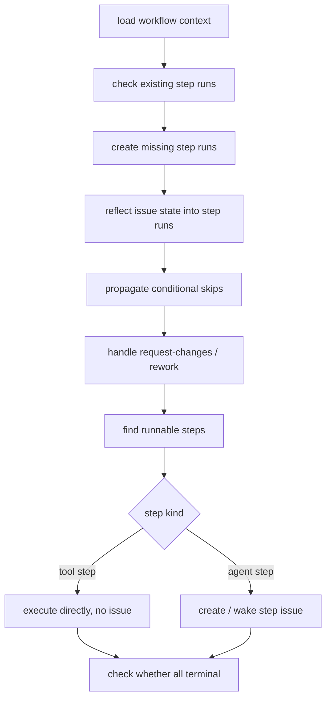

#### 3. 이슈가 에이전트 작업이 됨

에이전트가 처리해야 할 작업은 보통 이슈로 표현됩니다. DAG가 "이 스텝에는 에이전트가 필요하다"고 판단하면 이슈를 만들거나 기존 이슈를 깨웁니다. 여기부터 `heartbeatService(...)`가 이어받습니다.

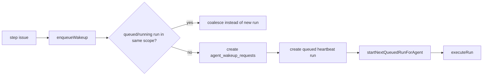

## 하트비트는 왜 별도로 존재하나요?(Why does the heartbeat exist separately?)

워크플로는 **무엇을 할지**를 결정하고, 하트비트는 **지금 어떤 에이전트를 깨울지**를 결정합니다.

### 하트비트 내부 동작(Heartbeat internals)

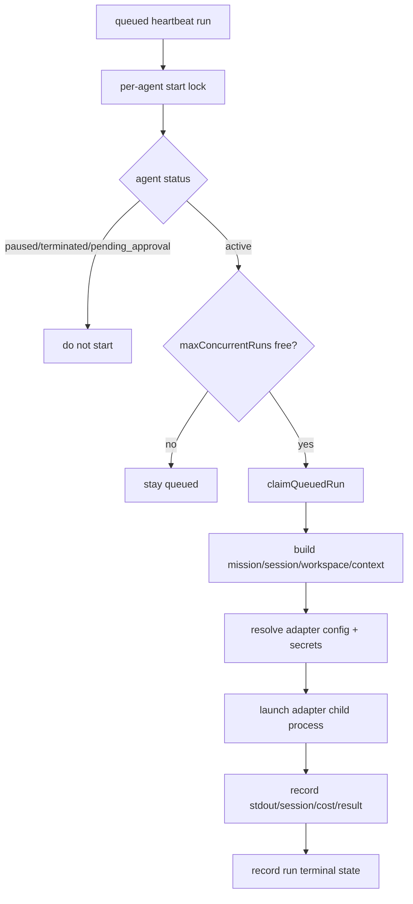

### 흔한 오해(Common misconceptions)

| 오해(Misconception) | 실제(Reality) |
| --- | --- |
| 웨이크업 요청은 항상 새 런을 만든다 | 같은 범위에 queued/running 런이 있으면 합쳐질(coalesce) 수 있습니다. |
| 워크플로 런이 running이면 어댑터가 실행 중이다 | 꼭 그렇지는 않습니다 — 워크플로 런이 `running`인데 하트비트는 끝났거나 대기 중일 수 있습니다. |
| 이슈가 `done`이면 모든 프로세스가 끝났다 | 꼭 그렇지는 않습니다 — 어댑터 자식 프로세스가 종료되지 않고 `running`을 붙들고 있을 수 있습니다. |
| 테이블 하나면 원인을 찾을 수 있다 | 보통 미션, 워크플로 런, 스텝 런, 이슈, 하트비트 런을 함께 봐야 합니다. |

### 플러그인 툴 호출 URL(Plugin tool invocation URLs)

에이전트가 플러그인 툴(예: Research Workbench)을 호출하면 `PAPERCLIP_API_BASE_URL/plugins/tools/execute`를 요청합니다. 어댑터는 포트를 추측해서는 안 됩니다. 실행 직전에 하트비트가 현재 컨트롤 플레인 URL을 런 컨텍스트에 넣고, 어댑터가 그 값을 최우선 순위로 환경에 주입합니다.

| 값(Value) | 의미(Meaning) | 예시(Example) |
| --- | --- | --- |
| `paperclipApiUrl` | `/api`가 없는 런타임 오리진 | `http://127.0.0.1:3200` |
| `paperclipApiBaseUrl` | 에이전트/플러그인 호출용 API 베이스 | `http://127.0.0.1:3200/api` |
| `PAPERCLIP_API_URL` | 어댑터 자식 프로세스에 전달되는 런타임 오리진 | `http://127.0.0.1:3200` |
| `PAPERCLIP_API_BASE_URL` | 어댑터 자식 프로세스가 플러그인 툴에 사용하는 API 베이스 | `http://127.0.0.1:3200/api` |

이 값들은 실행 시점에 런타임 설정에서 다시 계산되므로, 어댑터, 플러그인, 에이전트 지침은 포트를 하드코딩하는 대신 `PAPERCLIP_API_BASE_URL`을 사용해야 합니다.

플러그인 툴 실행 요청은 손으로 만든 문자열이 아니라 환경 변수를 직접 사용해야 합니다:

```json
{
  "agentId": "$PAPERCLIP_AGENT_ID",
  "runId": "$PAPERCLIP_RUN_ID",
  "companyId": "$PAPERCLIP_COMPANY_ID"
}
```

`runId`나 `agentId`가 틀리면 호스트가 `Agent run context is not valid for tool execution`으로 호출을 차단합니다 — 이것은 URL 문제가 아니라 인가(authorization) 실패입니다.

### 상태가 분할된 이유(Why state is split)

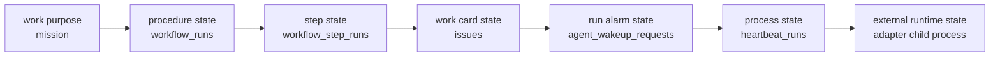

## 복구 루프: 멈춘 상태는 누가 정리하나요?(Recovery loops)

papercompany에는 두 종류의 복구 루프가 있습니다.

### 하트비트 복구(Heartbeat recovery)

`createHeartbeatScheduler(...)`는 세 개의 레인(lane)을 실행합니다:

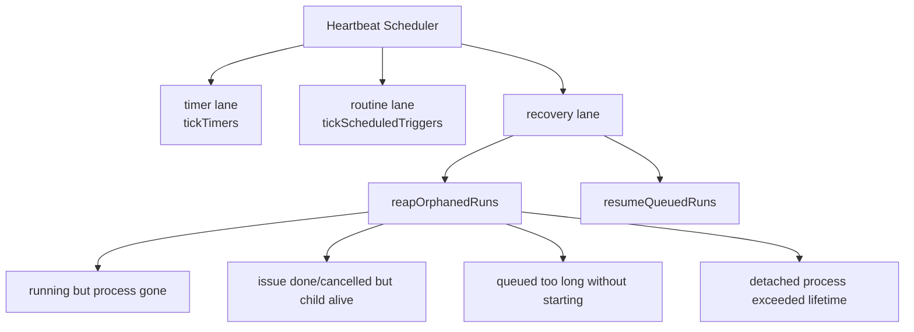

하트비트 복구는 에이전트 런 알람과 프로세스가 얽혀 있는지 봅니다.

### 워크플로 복구(Workflow recovery)

`createNativeWorkflowReconciler(...)`는 워크플로 런이 너무 오래 `running` 상태인지 봅니다:

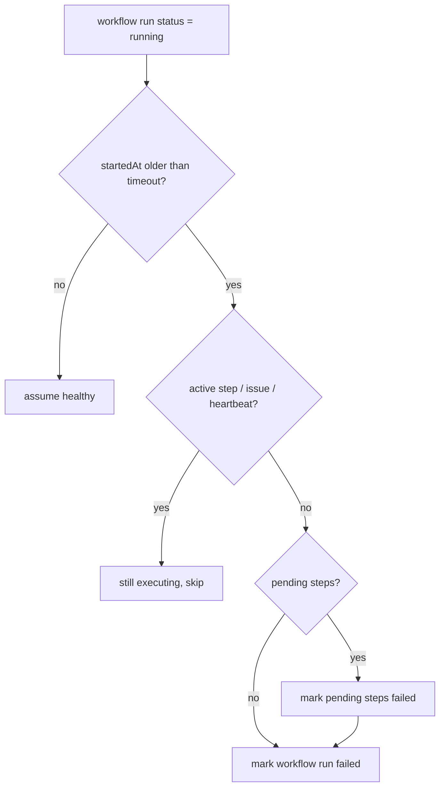

### 두 루프의 차이(Difference between the two loops)

| 측면(Aspect) | 하트비트 복구(Heartbeat recovery) | 워크플로 복구(Workflow recovery) |
| --- | --- | --- |
| 감시 대상(Watches) | `heartbeat_runs`, 프로세스, 웨이크업 요청 | `workflow_runs`, `workflow_step_runs`, 이슈 링크 |
| 핵심 함수(Key functions) | `reapOrphanedRuns`, `resumeQueuedRuns` | `reconcileWorkflow`, `reconcileStuckWorkflowRuns` |
| 고치는 것(Fixes) | 종료되지 않는 어댑터 자식, 시작되지 않는 큐, 유실된 프로세스 | `running`으로 남은 워크플로 런 |
| 주의점(Caution) | 이슈 상태와 프로세스 상태가 어긋날 수 있음 | 활성 스텝이 있는 동안 런을 실패 처리하지 말 것 |

## 운영자 매뉴얼: "미션이 움직이지 않는다" — 어디를 볼까

위에서 아래로 좁혀 나가세요:

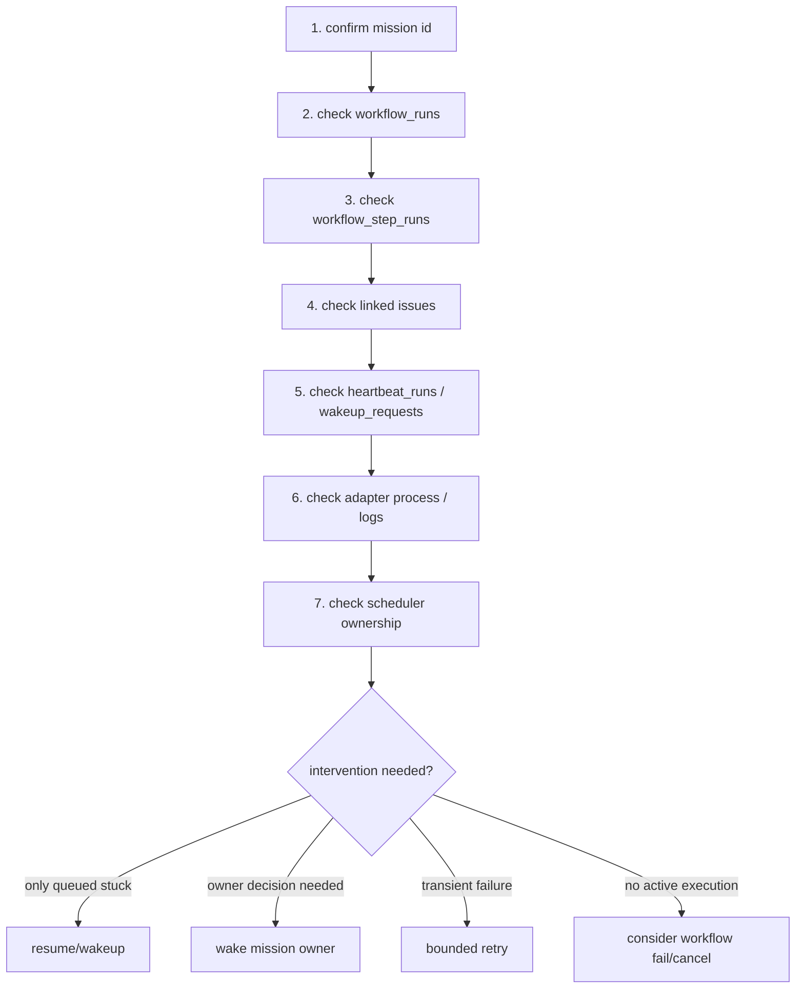

### 1단계: 먼저 미션과 워크플로 런을 보세요

확인할 것:

- `workflow_runs.status`
- `workflow_runs.trigger_source`
- `workflow_runs.scheduled_slot_id`
- `workflow_runs.started_at`
- `workflow_runs.completed_at`

| 보이는 것(What you see) | 의미(Meaning) |
| --- | --- |
| `running` + 최근 스텝/하트비트 | 건강하게 진행 중일 가능성이 높음. |
| `running` + 오래된 started_at + 활성 스텝 없음 | 워크플로 리컨실러의 대상. |
| 같은 날짜와 예약 슬롯에 여러 활성 런 | 스케줄러 소유권 또는 중복 가드 문제를 의심. |

### 2단계: 스텝 런과 이슈 링크를 보세요

확인할 것:

- `workflow_step_runs.status`
- `workflow_step_runs.issue_id`
- `workflow_step_runs.iteration_index`
- 연결된 이슈의 `status`, `assignee_agent_id`, `mission_id`

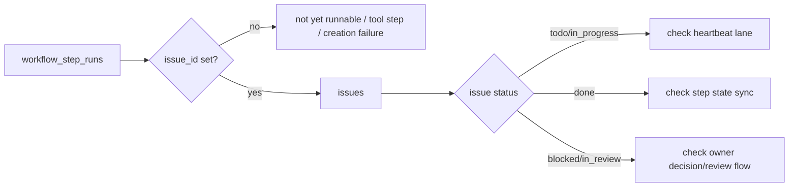

### 3단계: 하트비트 런을 보세요

확인할 것:

- `heartbeat_runs.status`
- `heartbeat_runs.error_code`
- `agent_wakeup_requests.status`
- `process_pid`
- `session_id_before`, `session_id_after`
- 런 이벤트/로그

| 보이는 것(What you see) | 의심할 것(Suspect) |
| --- | --- |
| `queued`인데 에이전트의 running 런이 없음 | `resumeQueuedRuns()` 또는 에이전트 상태 |
| `running`인데 프로세스 핸들이 없음 | `process_detached`, `process_lost` 경로 |
| 이슈 `done`인데 런은 여전히 `running` | 어댑터 자식이 종료되지 않음 |
| 반복 실패 후 폴백 런 | 어댑터 폴백 구성과 원래 커맨드 |

### 4단계: 스케줄러 소유권을 확인하세요

papercompany에는 네이티브 스케줄러와 플러그인 워크플로 엔진 사이에 경계가 있습니다. 소유권이 어긋나면 중복 런이나 복구 누락이 발생할 수 있습니다.

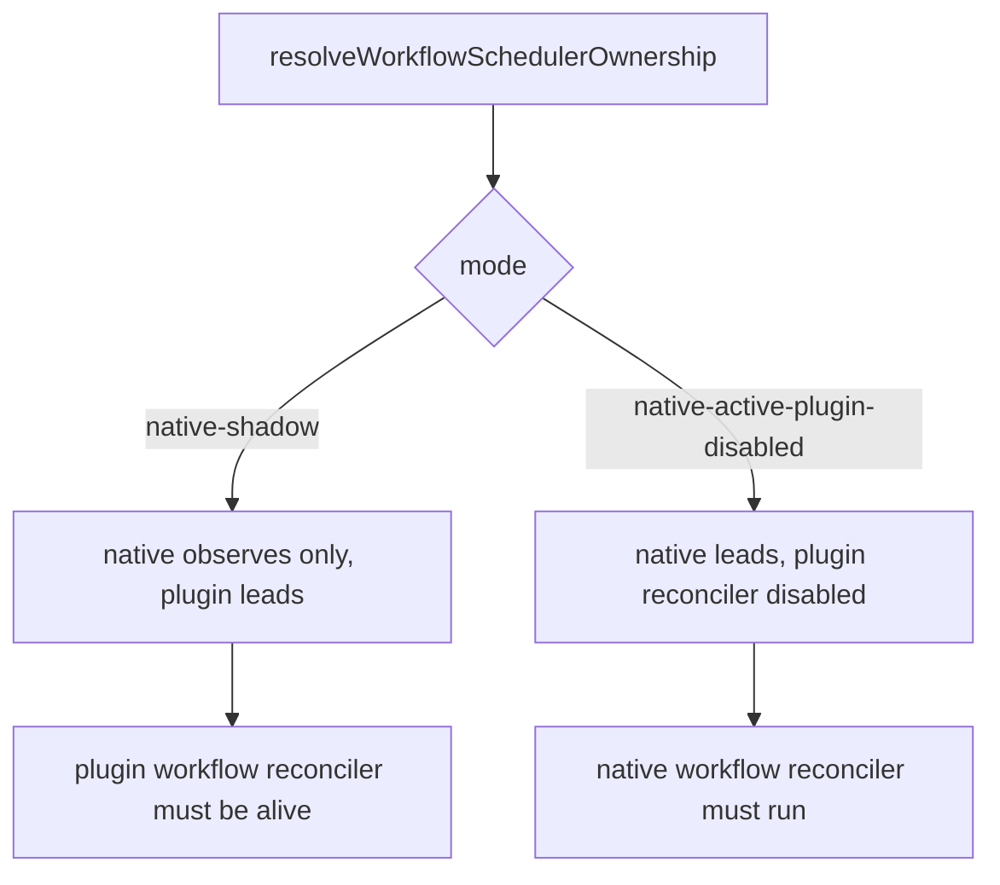

## 다섯 가지 흔한 실패 형태(Five common failure shapes)

### 실패 1. Queued인데 시작되지 않음

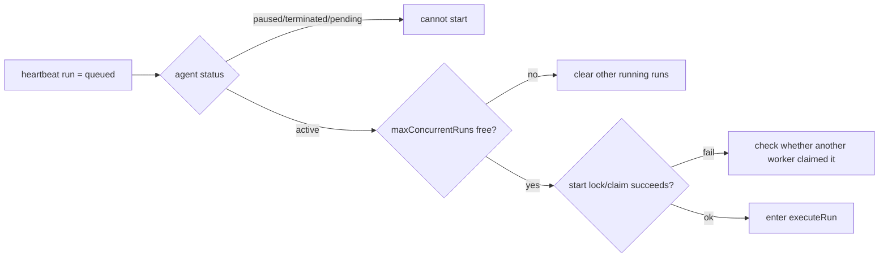

**코드**: `startNextQueuedRunForAgent(...)`, `resumeQueuedRuns()`, `reapOrphanedRuns(...)`

### 실패 2. 이슈는 done인데 프로세스가 아직 살아 있음

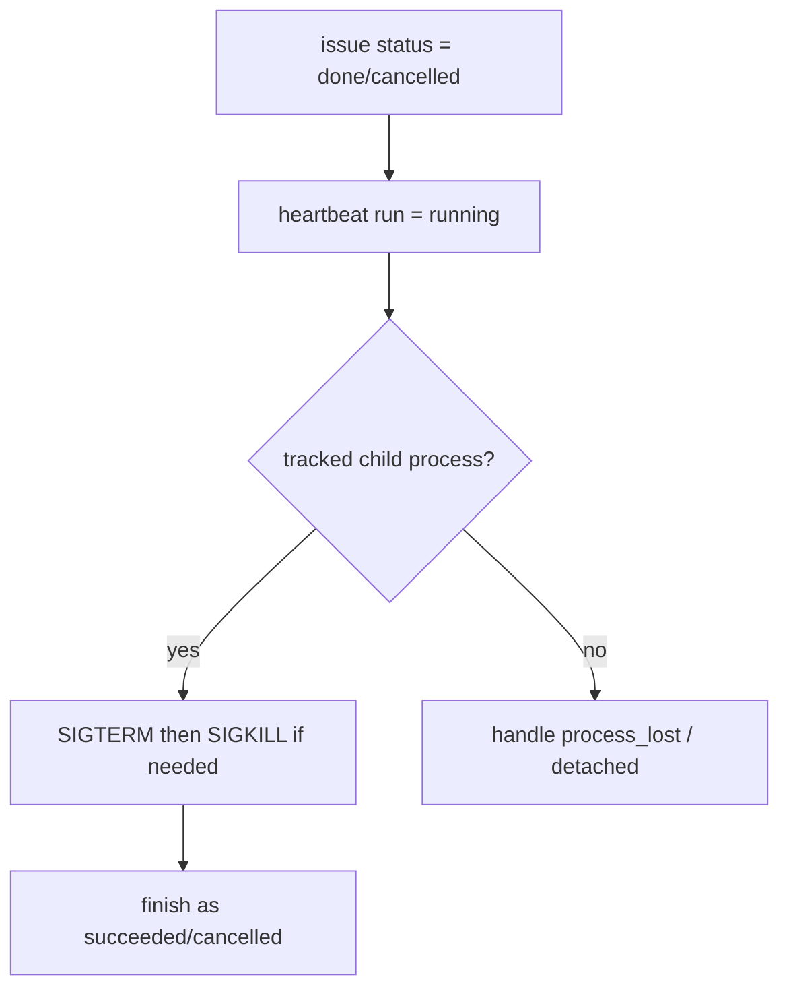

**코드**: `reapOrphanedRuns(...)`의 이슈 done/cancelled 자식 종료 경로

### 실패 3. 스텝 실패 후 워크플로 런이 running으로 남음

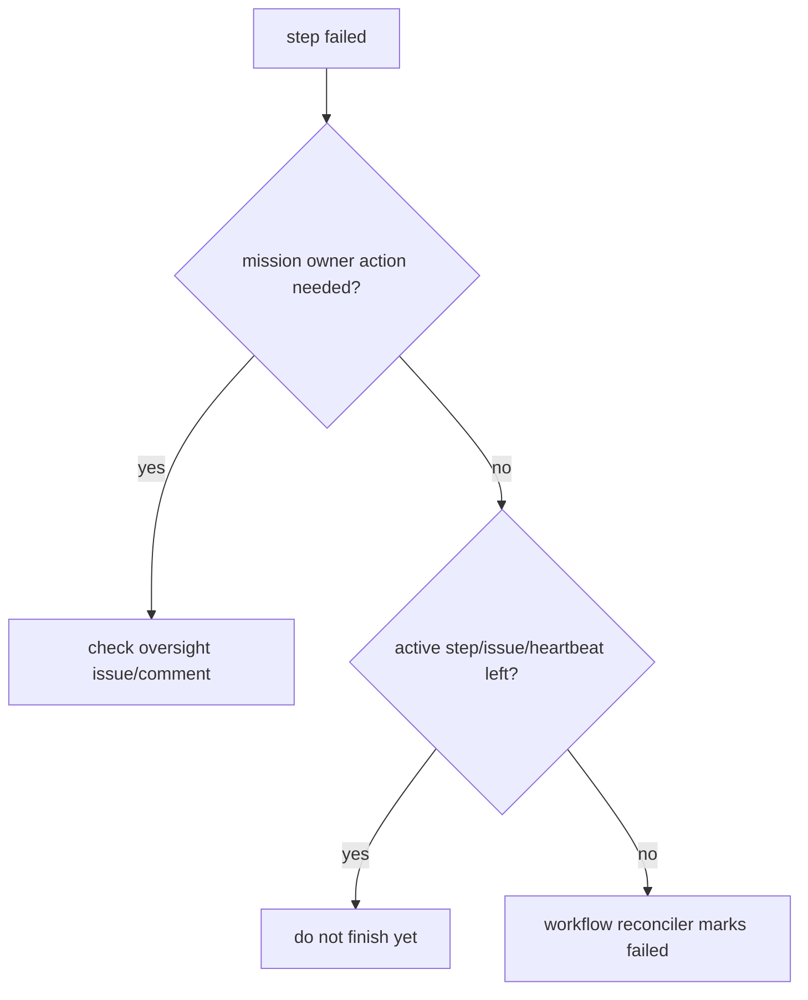

**코드**: `syncWorkflowRunState(...)`, `commentOnMainExecutorOversightForFailures(...)`, `createNativeWorkflowReconciler(...)`

### 실패 4. 같은 예약 미션이 두 번 실행됨

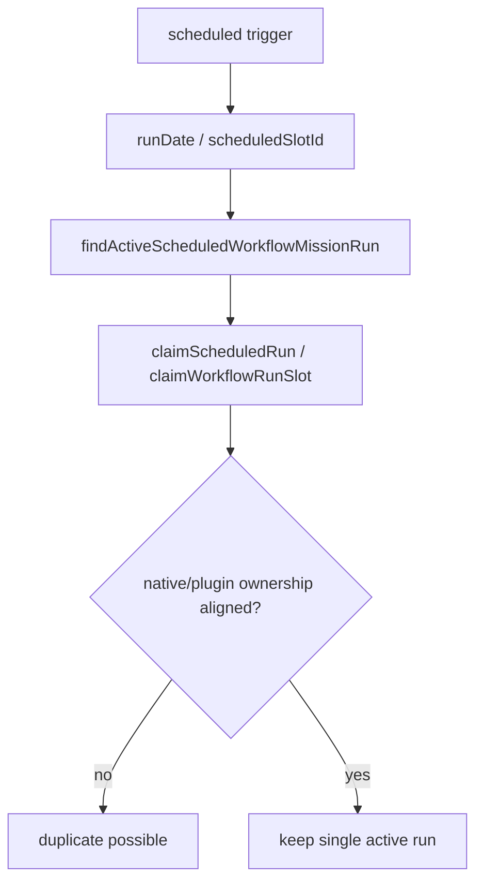

**코드**: `assertNoImplicitDuplicateScheduledWorkflowRun(...)`, `findActiveScheduledWorkflowMissionRun(...)`, `claimScheduledRun(...)`

### 실패 5. 미션 세션과 태스크 세션이 얽힘

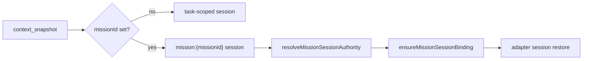

**코드**: `resolveMissionSessionAuthority(...)`, `ensureMissionSessionBinding(...)`, `executeRun(...)`

## 바로 사용 가능한 체크리스트(Ready-to-use checklist)

미션이 멈춘 것 같으면 이 순서를 따르세요:

1. **먼저 미션 ID를 고정하세요.** 이름이나 날짜에 의존하지 말고 실제 ID를 확정하세요.
2. **워크플로 런 상태를 보세요.** `running`, `failed` 또는 `completed`.
3. **스텝 런을 보세요.** 어떤 스텝이 `pending`, `running` 또는 `failed`인지.
4. **연결된 이슈를 보세요.** `todo`, `in_progress`, `done`, `blocked` 또는 `in_review`.
5. **하트비트 런을 보세요.** `queued`, `running`, `failed` 또는 `timed_out`.
6. **어댑터 프로세스를 보세요.** 이슈가 done인데 자식 프로세스가 아직 살아 있는지 확인.
7. **스케줄러 소유권을 확인하세요.** 네이티브와 플러그인 중 누가 스케줄을 소유하는지.
8. **최소한으로 개입하세요.** 워크플로를 함부로 취소하지 마세요 — 순서대로 진행하세요: queued 재개 → 오너 웨이크업 → 제한된 재시도 → 실패/취소.

### 핵심 정리(Key takeaway)

> papercompany 런타임 실패는 대개 "한 줄짜리 버그"가 아니라 **상태 동기화 문제**입니다.  
> 좋은 운영자는 한 테이블만 쳐다보지 않습니다. **미션 → 워크플로 런 → 스텝 런 → 이슈 → 웨이크업 → 하트비트 → 어댑터**를 하나의 체인으로 추적합니다.
